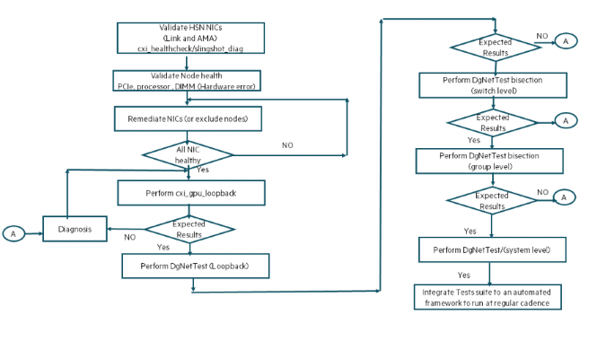

# Fabric validation using `dgnettest`

Requirements for `dgnettest` are as follows:

- Cray MPI stack
- Job Scheduler (Slurm or PBS/PALS)
- `cray-diags` is installed.

The high-level process flow for fabric validation at scale for compute node is provided in this section.
At every stage, different tests are run to eliminate any unhealthy NICs or Nodes. After nodes are validated individually, fabric tests are done with `dgnettest` at scale in the following systematic process:

- Switch level (To eliminate any issues at switch)
- Group level (To eliminate any issues at individual groups)
- System level (To isolate any issues at system level)

After system level tests are completed successfully, these nodes are then eligible for application execution.

See the following figure for a process flow for fabric validation with `dgnettest`:



Allocate a set of nodes from a job scheduler (Slurm, PBS).

- For PBS:

  ```screen
  uan-0001# qsub -I -l select=32,walltime=00:60:00 -A <Account_string> -q <destination>
  ```

- For Slurm:

  ```screen
  uan-0001# salloc -N 32 -t 60 --account=<Account_string> -p <partition>
  ```

**Note:** Use the Job scheduler deployment and queue as per the configuration used on site.

## Procedure

1. Validate node and HSN NIC health using `cxi_healthcheck` and `slingshot-diag`.

    The example script [`get_cxi_healthcheck.sh`](./scripts.md#scripts) can be executed from a head node (where `pdsh` can reach all compute nodes that are being tested) for performing `cxi_healthcheck` concurrently on all the nodes.

    The recommendation is to include this in the prolog of PBS or Slurm.

2. Validate node health and ensure that there are no hardware errors.

    Hardware errors can impact any fabric tests and subsequent application execution.
    The following list of errors that are caught using `dmesg`.
    Any nodes with these symptoms require hardware triage and must be isolated from the scale testing for next step.

    ```screen
    [Hardware Error]:  section_type: general processor error
    [Hardware Error]:  section_type: memory error
    [Hardware Error]:  section_type: PCIe error
    ```

    The [`get_nodes_hardware_error.sh`](./scripts.md#scripts) example script enables users to isolate hardware errors at scale.
    This can be run from a head node (admin_vm) and can run concurrently on all the nodes.

    The recommendation is it to include the checks in the prolog of PBS or Slurm.
    The hardware error messages shown above are platform specific and OS dependent.
    See the platform specific documentation for the exact format of error messages.

3. Execute loopback tests on nodes using `cxi_gpu_loopback`. Eliminate any nodes that fall below the threshold.

    The [`get_nodes_hsn_loopback.sh`](./scripts.md#scripts) example script shown in this step is a sample illustration to execute cxi loopback concurrently on all the nodes and isolate nodes that are below the threshold value.

    The recommendation is it to include the checks in the prolog of PBS or Slurm.

4. Execute `dgnettest` on the set of nodes allocated by PBS job scheduler in the following order.

    This example illustrates the ability to run `dgnettest` across a set of compute nodes to validate Slingshot network between the compute nodes.

    - Switch level
    - Group level
    - System level

    See the following substeps:

    1. Execute `dgnettest` at the switch level by using the option `-s` (set size) with 16.

       This will result internally in `dgnettest` in creating multiple sets with each set containing the set of NICs connected to same switch and running the tests on those set of NICs. All the sets are tested concurrently. If any individual set has issue, `dgnettest` will report the same and those nodes and the switch must be isolated for diagnosis.
       In the following example, both bisection and all2all tests are run at switch level on 128 nodes. There are 28 switches that are involved in the example allocation of nodes which are run as 28 independent sets.

       **Note:** Test requires at least two nodes connected to same switch for bisection and four nodes connected to same switch to all2all. Any set with less than these number of nodes is reported as “Not enough nodes”.

       See the [`dgnet_switch.sh`](./scripts.md#dgnettest_switch_level_pbssh) script in the appendix for the example script used in this step.
       For Slurm, use `dgnet_switch.sh` provided in `/usr/local/diag/bin` installed as part of `cray-diags-fabrics`.

        ```screen
        nidXXXXX# ./dgnettest_switch_level_pbs.sh $PBS_NODEFILE
        Number of nodes: 128
        number of process: 1024
        Executing Bisection tests
        nprocs=1024 sets=28 maxbytes=131072 ppn=8 (Warning: no PMI set manually)
        Test      Iter    Bytes  Set      Base  Ranks   Reps     Secs  BW/proc  BW/node
        bisect       1   131072 1770 055.10.00     32     31  0.00045  8818.73 70549.88
        bisect       1   131072 1774 055.14.00     40     31  0.00066  7583.93 60671.43
        bisect       1   131072 1782 055.22.00     32     31  0.00045  8866.69 70933.56
        bisect       1   131072 1790 055.30.00     16     31  0.00023  8780.62 70244.96
        bisect       1   131072 1786 055.26.00     32     31  0.00045  8863.52 70908.17
        bisect       1   131072 3142 098.06.00     40     31  0.00065  7633.62 61068.95
        bisect       1   131072 1778 055.18.00     40     31  0.00066  7591.01 60728.10
        bisect       1   131072 3278 102.14.00     56     31  0.00092  7589.00 60712.00
        bisect       1   131072 3154 098.18.00     32     31  0.00045  8927.27 71418.14
        bisect       1   131072 3166 098.30.00     24     31  0.00039  7724.93 61799.43
        bisect       1   131072 3138 098.02.00     32     31  0.00045  8967.91 71743.25
        bisect       1   131072 3246 101.14.00     40     31  0.00066  7613.68 60909.46
        bisect       1   131072 3254 101.22.00     40     31  0.00066  7581.72 60653.74
        bisect       1   131072 3150 098.14.00     48     31  0.00067  8930.28 71442.26
        bisect       1   131072 3250 101.18.00     32     31  0.00045  8873.65 70989.23
        bisect       1   131072 3286 102.22.00     24     31  0.00038  7825.67 62605.32
        bisect       1   131072 3234 101.02.00     48     31  0.00067  8917.52 71340.18
        bisect       1   131072 3238 101.06.00     32     31  0.00045  8918.39 71347.11
        bisect       1   131072 3242 101.10.00     40     31  0.00066  7607.00 60856.01
        bisect       1   131072 3158 098.22.00     48     31  0.00067  8916.50 71332.03
        bisect       1   131072 3258 101.26.00     32     31  0.00045  8982.15 71857.24
        bisect       1   131072 3266 102.02.00     16     31  0.00037  5446.69 43573.53
        bisect       1   131072 3274 102.10.00     48     31  0.00068  8882.09 71056.71
        bisect       1   131072 3162 098.26.00     48     31  0.00066  9070.56 72564.46
        bisect       1   131072 3262 101.30.00     40     31  0.00065  7634.69 61077.55
        bisect       1   131072 3270 102.06.00     56     31  0.00092  7600.66 60805.29
        bisect       1   131072 3146 098.10.00     24     31  0.00039  7726.31 61810.45
        bisect       1   131072 3282 102.18.00     32     31  0.00044  9012.35 72098.80
        bisect       2   131072 1770 055.10.00     32  14661  0.00046  8756.41 70051.25
        bisect       2   131072 1774 055.14.00     40  14661  0.00066  7534.51 60276.11
        bisect       2   131072 1782 055.22.00     32  14661  0.00046  8788.62 70308.98
        bisect       2   131072 1790 055.30.00     16  14661  0.00023  8808.61 70468.89
        bisect       2   131072 1778 055.18.00     40  14661  0.00066  7542.60 60340.76
        bisect       2   131072 3142 098.06.00     40  14661  0.00066  7546.64 60373.09
        bisect       2   131072 1786 055.26.00     32  14661  0.00046  8777.58 70220.63
        bisect       2   131072 3278 102.14.00     56  14661  0.00093  7489.94 59919.51
        bisect       2   131072 3154 098.18.00     32  14661  0.00046  8779.90 70239.20
        bisect       2   131072 3242 101.10.00     40  14661  0.00066  7552.03 60416.22
        bisect       2   131072 3254 101.22.00     40  14661  0.00066  7527.02 60216.17
        bisect       2   131072 3138 098.02.00     32  14661  0.00045  8829.65 70637.23
        bisect       2   131072 3286 102.22.00     24  14661  0.00039  7696.16 61569.26
        bisect       2   131072 3246 101.14.00     40  14661  0.00066  7548.03 60384.28
        bisect       2   131072 3150 098.14.00     48  14661  0.00068  8768.92 70151.32
        bisect       2   131072 3158 098.22.00     48  14661  0.00068  8803.39 70427.13
        bisect       2   131072 3234 101.02.00     48  14661  0.00068  8804.15 70433.17
        bisect       2   131072 3274 102.10.00     48  14661  0.00068  8761.80 70094.39
        bisect       2   131072 3166 098.30.00     24  14661  0.00039  7665.47 61323.79
        bisect       2   131072 3262 101.30.00     40  14661  0.00067  7500.03 60000.26
        bisect       2   131072 3162 098.26.00     48  14661  0.00068  8779.48 70235.85
        bisect       2   131072 3238 101.06.00     32  14661  0.00045  8791.65 70333.21
        bisect       2   131072 3250 101.18.00     32  14661  0.00046  8744.64 69957.15
        bisect       2   131072 3266 102.02.00     16  14661  0.00037  5445.97 43567.75
        bisect       2   131072 3270 102.06.00     56  14661  0.00093  7489.18 59913.47
        bisect       2   131072 3258 101.26.00     32  14661  0.00045  8818.81 70550.49
        bisect       2   131072 3146 098.10.00     24  14661  0.00039  7680.85 61446.79
        bisect       2   131072 3282 102.18.00     32  14661  0.00045  8833.38 70667.06
        
        ...

        dgnettest has PASSED
        ```

        ```screen
        Executing all2all tests
        nprocs=1024 sets=28 maxbytes=131072 ppn=8 (Warning: no PMI set manually)
        Test      Iter    Bytes  Set      Base  Ranks   Reps     Secs  BW/proc  BW/node
        all2all      1   131072 1770 055.10.00     32   2963  0.00032 12640.37 101122.92
        all2all      1   131072 1774 055.14.00     40   2963  0.00036 13824.55 110596.42
        all2all      1   131072 1782 055.22.00     32   2963  0.00031 12820.05 102560.44
        all2all      1   131072 1786 055.26.00     32   2963  0.00030 13160.67 105285.36
        all2all      1   131072 1778 055.18.00     40   2963  0.00036 13820.40 110563.19
        all2all      1   131072 3142 098.06.00     40   2963  0.00037 13506.15 108049.16
        all2all      1   131072 3278 102.14.00     56   2963  0.00056 12450.72 99605.78
        all2all      1   131072 3138 098.02.00     32   2963  0.00029 13826.98 110615.83
        all2all      1   131072 3154 098.18.00     32   2963  0.00030 13316.79 106534.33
        all2all      1   131072 3254 101.22.00     40   2963  0.00038 13217.08 105736.65
        all2all      1   131072 3246 101.14.00     40   2963  0.00038 13064.08 104512.61
        all2all      1   131072 3150 098.14.00     48   2963  0.00045 13236.40 105891.22
        all2all      1   131072 3242 101.10.00     40   2963  0.00037 13543.51 108348.06
        all2all      1   131072 3158 098.22.00     48   2963  0.00046 13158.93 105271.42
        all2all      1   131072 3234 101.02.00     48   2963  0.00045 13334.42 106675.39
        all2all      1   131072 3250 101.18.00     32   2963  0.00031 12798.99 102391.89
        all2all      1   131072 3270 102.06.00     56   2963  0.00056 12455.25 99641.98
        all2all      1   131072 3238 101.06.00     32   2963  0.00028 14275.22 114201.74
        all2all      1   131072 3262 101.30.00     40   2963  0.00038 13324.97 106599.79
        all2all      1   131072 3274 102.10.00     48   2963  0.00045 13305.05 106440.43
        all2all      1   131072 3282 102.18.00     32   2963  0.00030 13451.00 107608.01
        all2all      1   131072 3258 101.26.00     32   2963  0.00031 13048.57 104388.54
        all2all      1   131072 3162 098.26.00     48   2963  0.00046 13027.30 104218.38
        all2all      2   131072 1770 055.10.00     32  17520  0.00029 13957.28 111658.28
        all2all      2   131072 1774 055.14.00     40  17520  0.00033 15040.72 120325.77
        all2all      2   131072 1782 055.22.00     32  17520  0.00029 13833.63 110669.01
        all2all      2   131072 3142 098.06.00     40  17520  0.00034 14624.19 116993.53
        all2all      2   131072 1786 055.26.00     32  17520  0.00028 14164.35 113314.83
        all2all      2   131072 3254 101.22.00     40  17520  0.00035 14232.62 113860.96
        all2all      2   131072 3278 102.14.00     56  17520  0.00052 13415.92 107327.39
        all2all      2   131072 3154 098.18.00     32  17520  0.00028 14321.95 114575.57
        all2all      2   131072 1778 055.18.00     40  17520  0.00033 15018.89 120151.15
        all2all      2   131072 3242 101.10.00     40  17520  0.00034 14737.46 117899.71
        all2all      2   131072 3138 098.02.00     32  17520  0.00027 15011.82 120094.54
        all2all      2   131072 3150 098.14.00     48  17520  0.00042 14306.84 114454.74
        all2all      2   131072 3246 101.14.00     40  17520  0.00035 14121.64 112973.13
        all2all      2   131072 3234 101.02.00     48  17520  0.00042 14366.89 114935.10
        all2all      2   131072 3262 101.30.00     40  17520  0.00035 14357.18 114857.41
        all2all      2   131072 3162 098.26.00     48  17520  0.00043 13892.34 111138.75
        all2all      2   131072 3274 102.10.00     48  17520  0.00042 14251.48 114011.81
        all2all      2   131072 3158 098.22.00     48  17520  0.00042 14200.77 113606.12
        all2all      2   131072 3250 101.18.00     32  17520  0.00029 13936.76 111494.07
        all2all      2   131072 3282 102.18.00     32  17520  0.00028 14500.18 116001.43
        all2all      2   131072 3270 102.06.00     56  17520  0.00052 13585.15 108681.24
        all2all      2   131072 3238 101.06.00     32  17520  0.00026 15577.32 124618.60
        all2all      2   131072 3258 101.26.00     32  17520  0.00028 14098.62 112788.92
        
        ...

        dgnettest has PASSED
        ```

    2. Execute `dgnettest` at group level by using the option `-s` (set size) with 512.

       This will result internally in `dgnettest` in creating multiple sets with each set containing the set of NICs connected to same Slingshot group and running the tests on those set of NICs. All the sets are tested concurrently.
       If any individual set has issue, `dgnettest` will report the same and those nodes and the group must be isolated for diagnosis. In the following example, both bisection and all2all tests are run at group level on 128 nodes.
       There are 4 groups that are involved in the example allocation of nodes which are run as four independent sets.

       **Note:** See the [`dgnettest_group_level_pbs.sh`](./scripts.md#scripts) in the appendix for the example script in this step.
       For Slurm, use `dgnet_local.sh` provided in `/usr/local/diag/bin` installed as part of `cray-diags-fabrics`.

        ```screen
        nidXXXXX# ./dgnettest_local_level_pbs.sh $PBS_NODEFILE
        Number of nodes: 128
        number of process: 1024
        Executing Bisection tests
        nprocs=1024 sets=4 maxbytes=131072 ppn=8 (Warning: no PMI set manually)
        Test      Iter    Bytes  Set      Base  Ranks   Reps     Secs  BW/proc  BW/node
        bisect       1   131072   55 055.00.00    192   2666  0.00318  7545.50 60364.01
        bisect       1   131072   98 098.00.00    296   2666  0.00494  7497.00 59975.99
        bisect       1   131072  102 102.00.00    232   2666  0.00552  5252.87 42022.94
        bisect       1   131072  101 101.00.00    304   2666  0.00506  7513.23 60105.86
        bisect       2   131072   55 055.00.00    192   2688  0.00317  7569.18 60553.45
        bisect       2   131072   98 098.00.00    296   2688  0.00493  7501.69 60013.53
        bisect       2   131072  101 101.00.00    304   2688  0.00505  7528.83 60230.65
        bisect       2   131072  102 102.00.00    232   2688  0.00550  5273.29 42186.35
        bisect       3   131072   55 055.00.00    192   2712  0.00317  7567.45 60539.61
        bisect       3   131072   98 098.00.00    296   2712  0.00493  7500.82 60006.59
        bisect       3   131072  101 101.00.00    304   2712  0.00505  7523.17 60185.34
        bisect       3   131072  102 102.00.00    232   2712  0.00549  5280.42 42243.35
        dgnettest has PASSED
        Executing all2all tests
        nprocs=1024 sets=4 maxbytes=131072 ppn=8 (Warning: no PMI set manually)
        Test      Iter    Bytes  Set      Base  Ranks   Reps     Secs  BW/proc  BW/node
        all2all      1   131072   55 055.00.00    192   1009  0.00248  9696.30 77570.41
        all2all      1   131072   98 098.00.00    296   1009  0.00377  9821.15 78569.20
        all2all      1   131072  101 101.00.00    304   1009  0.00388  9799.75 78397.98
        all2all      1   131072  102 102.00.00    232   1009  0.00513  5653.91 45231.29
        all2all      2   131072   55 055.00.00    192   2238  0.00237 10117.75 80942.00
        all2all      2   131072   98 098.00.00    296   2238  0.00413  8962.29 71698.34
        all2all      2   131072  101 101.00.00    304   2238  0.00366 10372.26 82978.11
        all2all      2   131072  102 102.00.00    232   2238  0.00512  5668.56 45348.45
        all2all      3   131072   55 055.00.00    192   1909  0.00237 10112.09 80896.70
        all2all      3   131072   98 098.00.00    296   1909  0.00356 10390.28 83122.24
        all2all      3   131072  101 101.00.00    304   1909  0.00365 10417.69 83341.55
        all2all      3   131072  102 102.00.00    232   1909  0.00511  5679.94 45439.54
        all2all      4   131072   55 055.00.00    192   1908  0.00238 10072.84 80582.72
        all2all      4   131072   98 098.00.00    296   1908  0.00356 10400.78 83206.21
        all2all      4   131072  101 101.00.00    304   1908  0.00364 10435.44 83483.56
        all2all      4   131072  102 102.00.00    232   1908  0.00510  5683.89 45471.14
        all2all      5   131072   55 055.00.00    192   2222  0.00238 10083.70 80669.60
        all2all      5   131072   98 098.00.00    296   2222  0.00356 10398.07 83184.59
        all2all      5   131072  101 101.00.00    304   2222  0.00365 10418.87 83350.94
        all2all      5   131072  102 102.00.00    232   2222  0.00510  5689.92 45519.37
        all2all      6   131072   55 055.00.00    192   1938  0.00238 10073.99 80591.91
        all2all      6   131072   98 098.00.00    296   1938  0.00356 10402.19 83217.49
        all2all      6   131072  101 101.00.00    304   1938  0.00365 10415.94 83327.51
        all2all      6   131072  102 102.00.00    232   1938  0.00509  5692.81 45542.45
        all2all      7   131072   55 055.00.00    192   1932  0.00238 10065.56 80524.47
        all2all      7   131072   98 098.00.00    296   1932  0.00356 10389.71 83117.64
        all2all      7   131072  101 101.00.00    304   1932  0.00365 10415.82 83326.59
        all2all      7   131072  102 102.00.00    232   1932  0.00509  5696.04 45568.35
        all2all      8   131072   55 055.00.00    192   2243  0.00238 10079.43 80635.47
        all2all      8   131072   98 098.00.00    296   2243  0.00356 10400.47 83203.72
        all2all      8   131072  101 101.00.00    304   2243  0.00365 10406.14 83249.14
        all2all      8   131072  102 102.00.00    232   2243  0.00509  5699.69 45597.52

        MPICH Slingshot Network Summary: 1 network timeouts

        dgnettest has PASSED
        ```

    3. Execute `dgnettest` at system level by using the option `-s` (set size) with 131072.

        This script will result internally in `dgnettest` in creating a single set containing all the hosts and all the NICs of the hosts.

        **Note:** See the [`dgnettest_system_level_pbs.sh`](./scripts.md#scripts) in the appendix for the sample script.
        For Slurm, use `dgnet_system.sh` provided in `/usr/local/diag/bin` installed as part of `cray-diags-fabrics`.

        ```screen
        # ./dgnettest_system_level_pbs.sh $PBS_NODEFILE
        Number of nodes: 128
        number of process: 1024
        Executing Bisection tests
        nprocs=1024 sets=1 maxbytes=131072 ppn=8 (Warning: no PMI set manually)
        Test      Iter    Bytes  Set      Base  Ranks   Reps     Secs  BW/proc  BW/node
        bisect       1   131072    0 000.00.00   1024    517  0.02844  4500.23 36001.82
        bisect       2   131072    0 000.00.00   1024    532  0.02839  4508.10 36064.78
        bisect       3   131072    0 000.00.00   1024    531  0.02840  4507.41 36059.27
        dgnettest has PASSED
        Executing all2all tests
        nprocs=1024 sets=1 maxbytes=131072 ppn=8 (Warning: no PMI set manually)
        Test      Iter    Bytes  Set      Base  Ranks   Reps     Secs  BW/proc  BW/node
        all2all      1   131072    0 000.00.00   1024    653  0.02573  4974.52 39796.18
        all2all      2   131072    0 000.00.00   1024    660  0.02368  5405.48 43243.82
        all2all      3   131072    0 000.00.00   1024    658  0.02283  5606.52 44852.18
        all2all      4   131072    0 000.00.00   1024    657  0.02291  5588.18 44705.43
        all2all      5   131072    0 000.00.00   1024    647  0.02281  5610.83 44886.61
        dgnettest has PASSED
        ```

        **Note:** `dgnettest` can be run at switch level, group level, and at system level. The option `-s` allows users to specify the scale level.
        For switch level, it is 16, and for group level, it is 512 (32 switches in a Slingshot group and for the system level it is 131072).

        For more information on `dgnettest`, see the _HPE Slingshot Host Software Troubleshooting Guide_.
