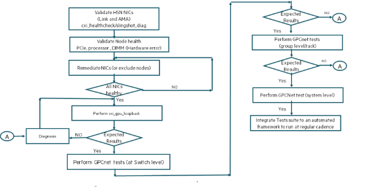

# Fabric validation using GPCNet tests

GPCNet benchmark provides the following capabilities:

- **Natural Ring Communication Pattern** - All processors communicate with their neighbors simultaneously based on adjacent MPI ranks.
- **Random Ring Communication Pattern** - Processors are paired with random nodes that do not live on a physical neighbor in the machine.

See [GPCNET in GitHub](https://github.com/netbench/GPCNET) for additional details.

GPCNet is an MPI application. The process flow for fabric validation at the scale of compute nodes using GPCNet is similar to OSU tests.



The test requires GPCNet images in the same location on all compute nodes.
In the following example, `/tmp/gpc` is used as the common location for placing GPCNet images.
The test also has output of packets transmitted and received for all the HSN devices during the test.

See [`run_gpc_tests.sh`](./scripts.md#scripts) in the Appendix for the example script.

```screen
nidXXXXX# ./run_gpc_tests.sh $PBS_NODEFILE
Number of nodes: 64
number of process: 2048
Executing gpc network test
Network Tests v1.3
  Test with 2048 MPI ranks (64 nodes)

  Legend
   RR = random ring communication pattern
   Nat = natural ring communication pattern
   Lat = latency
   BW = bandwidth
   BW+Sync = bandwidth with barrier
+------------------------------------------------------------------------------+
|                            Isolated Network Tests                            |
+---------------------------------+--------------+--------------+--------------+
|                            Name |          Avg |          99% |        Units |
+---------------------------------+--------------+--------------+--------------+
|          RR Two-sided Lat (8 B) |          2.9 |          4.4 |         usec |
+---------------------------------+--------------+--------------+--------------+
|                RR Get Lat (8 B) |          4.4 |          5.4 |         usec |
+---------------------------------+--------------+--------------+--------------+
|      RR Two-sided BW (131072 B) |       4086.5 |       2504.7 |   MiB/s/rank |
+---------------------------------+--------------+--------------+--------------+
|            RR Put BW (131072 B) |       4910.4 |       2582.1 |   MiB/s/rank |
+---------------------------------+--------------+--------------+--------------+
| RR Two-sided BW+Sync (131072 B) |       3786.1 |        485.1 |   MiB/s/rank |
+---------------------------------+--------------+--------------+--------------+
|     Nat Two-sided BW (131072 B) |       4975.3 |       3436.7 |   MiB/s/rank |
+---------------------------------+--------------+--------------+--------------+
|        Multiple Allreduce (8 B) |         25.3 |         27.7 |         usec |
+---------------------------------+--------------+--------------+--------------+
|      Multiple Alltoall (4096 B) |       2648.4 |       2454.7 |   MiB/s/rank |
+---------------------------------+--------------+--------------+--------------+
cxi0 tx 587019953
cxi0 rx 586975503
cxi1 tx 583560730
cxi1 rx 583504665
cxi2 tx 583778072
cxi2 rx 583722440
cxi3 tx 583625482
cxi3 rx 583612423
cxi4 tx 583639928
cxi4 rx 583594369
cxi5 tx 583728508
cxi5 rx 583704199
cxi6 tx 583915047
cxi6 rx 583888045
cxi7 tx 584025550
cxi7 rx 584010210
```

```screen
Executing gpc network Load test
NetworkLoad Tests v1.3
  Test with 2048 MPI ranks (64 nodes)
  13 nodes running Network Tests
  51 nodes running Congestion Tests (min 12 nodes per congestor)

  Legend
   RR = random ring communication pattern
   Lat = latency
   BW = bandwidth
   BW+Sync = bandwidth with barrier
+------------------------------------------------------------------------------+
|                            Isolated Network Tests                            |
+---------------------------------+--------------+--------------+--------------+
|                            Name |          Avg |          99% |        Units |
+---------------------------------+--------------+--------------+--------------+
|          RR Two-sided Lat (8 B) |          2.9 |          4.3 |         usec |
+---------------------------------+--------------+--------------+--------------+
| RR Two-sided BW+Sync (131072 B) |       4061.4 |       2829.5 |   MiB/s/rank |
+---------------------------------+--------------+--------------+--------------+
|        Multiple Allreduce (8 B) |         20.2 |         22.2 |         usec |
+---------------------------------+--------------+--------------+--------------+

+------------------------------------------------------------------------------+
|                 Network Tests running with Congestion Tests                  |
+---------------------------------+--------------+--------------+--------------+
|                            Name |          Avg |          99% |        Units |
+---------------------------------+--------------+--------------+--------------+
|          RR Two-sided Lat (8 B) |          2.9 |          4.3 |         usec |
+---------------------------------+--------------+--------------+--------------+
| RR Two-sided BW+Sync (131072 B) |       4057.7 |       2820.6 |   MiB/s/rank |
+---------------------------------+--------------+--------------+--------------+
|        Multiple Allreduce (8 B) |         20.3 |         22.2 |         usec |
+---------------------------------+--------------+--------------+--------------+

+------------------------------------------------------------------------------+
|          Network Tests running with Congestion Tests - Key Results           |
+---------------------------------+--------------------------------------------+
|                            Name |                   Congestion Impact Factor |
+---------------------------------+----------------------+---------------------+
|                                 |                  Avg |                 99% |
+---------------------------------+----------------------+---------------------+
|          RR Two-sided Lat (8 B) |                 1.0X |                1.0X |
+---------------------------------+----------------------+---------------------+
| RR Two-sided BW+Sync (131072 B) |                 1.0X |                1.0X |
+---------------------------------+----------------------+---------------------+
|        Multiple Allreduce (8 B) |                 1.0X |                1.0X |
+---------------------------------+----------------------+---------------------+

cxi0 tx 867133826
cxi0 rx 867064877
cxi1 tx 862284335
cxi1 rx 862204615
cxi2 tx 863157373
cxi2 rx 863069639
cxi3 tx 862924375
cxi3 rx 862910359
cxi4 tx 863432283
cxi4 rx 863377741
cxi5 tx 863331479
cxi5 rx 863335302
cxi6 tx 862989492
cxi6 rx 862951918
cxi7 tx 863561826
cxi7 rx 863534760
```

**Note:** The test assumes that the binaries are in `/tmp/gpc` on every compute node.
Place the gpc binaries in `/tmp/gpc`.
