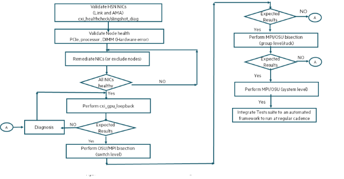

# Fabric validation using OSU tests

OSU Benchmark is a collection of MPI test suites that enable to collect key performance metrics (bandwidth and latency) for HPC fabrics.
They can operate on any of the standard MPI implementations.
OSU Micro-Benchmarks provide several different types of benchmarks that can be used to test and measure HPC network performance:

- Point-to-Point MPI Benchmarks: Latency, multi-threaded latency, multi-pair latency, multiple bandwidth / message rate test bandwidths, bidirectional bandwidth.
- One-sided MPI Benchmarks: one-sided put latency, one-sided put bandwidth, one-sided put bidirectional bandwidth, one-sided get latency, one-sided get bandwidth, one-sided accumulate latency.

See [the external benchmarks page](https://mvapich.cse.ohio-state.edu/benchmarks/) for more details.

For fabric validation, `osu_mbw_mr test` is used for bandwidth and `osu_multi_lat` test is used for latency.

The flow for fabric validation with OSU tests is shown in the following image:



Allocate a set of nodes from PBS:

```screen
uan-0001# qsub -I -l select=64,walltime=00:60:00 -A <Account_string> -q <destination>
```

Allocate a set of nodes from Slurm:

```screen
uan-0001# salloc -N 64 -t 60 --account=<Account_string> -p <partition>
```

See your site specific job scheduler, account, and queue for allocating a job.

## Procedure

1. Validate node and HSN NIC health using `cxi_healthcheck` and `slingshot-diag`.

   See the _HPE Slingshot Host Software Troubleshooting Guide_ for more information on these utilities.

2. Validate node health and ensure that there are no hardware errors.

   Hardware errors can impact any fabric tests and subsequently application execution. The following is a list of errors that are caught using `dmesg`.
   Any nodes with these symptoms require hardware triage and should be isolated from the scale testing for next step.

    ```screen
    [Hardware Error]:  section_type: general processor error
    [Hardware Error]:  section_type: memory error
    [Hardware Error]:  section_type: PCIe error
    ```

3. Execute loopback tests on nodes using `cxi_gpu_loopback` as explained in earlier section. Eliminate any nodes that fall below the threshold.

4. Perform OSU tests with the final set of nodes using the script in this step.

    OSU tests are executed on the entire set of nodes as single MPI job.
    It is possible to run the same at the switch level and group level using individual node files that has list of nodes connected to same switch and same group.

    This script assumes that the OSU images `osu_mbw_mr` and `osu_multi_lat` are available on all the nodes in the same location.
    See the [README-OMB.txt](https://mvapich.cse.ohio-state.edu/static/media/mvapich/README-OMB.txt) file for instructions on how to build OSU.

    **OSU bandwidth tests**

    The following example illustrates execution of OSU bandwidth tests on 64 nodes that has passed the prior validation steps.
    See the [Appendix](./appendix.md#appendix) for the test script `run_osu_bandwidth.sh`.

    This example uses 4 processes per NIC, with 64 nodes and 8 NICs, which results in 1024 pairs.
    For optimal performance, use the `cpu-bind` option to bind the process to CPU based on NUMA.
    See the MPI documentation for more details on the `cpu-bind` option.
    The output also displays the number of packets transmitted and received on each of the cxi devices during the test.  

    ```screen
    # ./run_osu_bandwidth.sh $PBS_NODEFILE
    Number of nodes: 64
    number of process: 2048
    Executing osu bandwidth tests
    # OSU MPI Multiple Bandwidth / Message Rate Test v7.1
    # OSU MPI Multiple Bandwidth / Message Rate Test v7.1

    # [ pairs: 1024 ] [ window size: 64 ]
    # Size                  MB/s        Messages/s
    # Datatype: MPI_CHAR.
    1                    2238.68     2238678471.43
    2                    4506.48     2253241978.68
    4                    9019.48     2254869773.78
    8                   18029.10     2253637880.74
    16                  36332.42     2270776007.55
    32                  72659.98     2270624517.07
    64                 136488.16     2132627440.68
    128                264199.64     2064059674.52
    256                504191.55     1969498238.56
    512               1002982.31     1958949822.63
    1024              1883179.25     1839042232.55
    2048              2786505.95     1360598608.87
    4096              3245610.39      792385349.18
    8192              3492389.73      426317105.31
    16384             4770180.77      291148728.77
    32768             5106849.27      155848671.59
    65536             5443378.29       83059361.06
    131072            5428900.72       41419225.50
    262144            5511979.83       21026534.40
    524288            5509387.81       10508323.31
    1048576           5558304.69        5300812.43
    2097152           5432969.50        2590641.74
    4194304           5457474.28        1301163.26
    cxi0 tx 115762638
    cxi0 rx 115940582
    cxi1 tx 115704907
    cxi1 rx 115883753
    cxi2 tx 115704730
    cxi2 rx 115883090
    cxi3 tx 115704005
    cxi3 rx 115881645
    cxi4 tx 115706392
    cxi4 rx 115886003
    cxi5 tx 115705311
    cxi5 rx 115884439
    cxi6 tx 115705688
    cxi6 rx 115884947
    cxi7 tx 115705550
    cxi7 rx 115884598
    ```

    **OSU latency tests**

    The following example illustrates execution of OSU latency tests on 64 nodes that has passed the prior validation steps.
    See the [Appendix](./appendix.md#appendix) for the test script `run_osu_latency.sh`.

    ```screen
    nidXXXXX# ./run_osu_latency.sh $PBS_NODEFILE
    Number of nodes: 64
    number of process: 2048
    Executing osu latency tests
    # OSU MPI Multi Latency Test v7.1
    # Size          Latency (us)
    # Datatype: MPI_CHAR.
    1                       4.35
    2                       4.30
    4                       4.23
    8                       4.23
    16                      4.26
    32                      4.21
    64                      4.20
    128                     5.15
    256                     5.63
    512                     5.72
    1024                    5.76
    2048                    5.89
    4096                    6.22
    8192                   12.36
    16384                  13.03
    32768                  14.84
    65536                  17.52
    131072                 21.23
    262144                 27.87
    524288                 41.27
    1048576                67.84
    2097152               121.39
    4194304               234.77
    cxi0 tx 37934791
    cxi0 rx 38000316
    cxi1 tx 35236930
    cxi1 rx 35237376
    cxi2 tx 35236924
    cxi2 rx 35237407
    cxi3 tx 35236842
    cxi3 rx 35237424
    cxi4 tx 35237028
    cxi4 rx 35238052
    cxi5 tx 35237041
    cxi5 rx 35237410
    cxi6 tx 35237072
    cxi6 rx 35237450
    cxi7 tx 35237282
    cxi7 rx 35237685
    ```

    The tests assume that OSU images are in `/tmp/osu` on compute nodes.
    Ensure the `LD_LIBRARY_PATH` is set to the referenced MPI and Libfabric libraries used for OSU images.
