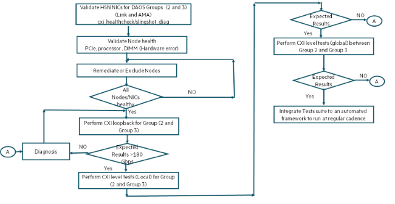

# HPE Slingshot validation of storage system

Storage system can be high performance scale out storage (Lustre, DAOS).
These nodes are typically connected to Top of the Rack (ToR) HPE Slingshot switches.

The storage nodes are part of Slingshot group 1–8.
In this example deployment, there are 1024 Storage nodes `Elbert-storage-[0001-1024]`.
Each Storage node has two HPE Slingshot HSN interfaces.


**Table:** HPE Slingshot group mapping of `Elbert` subsystems

| **Entity**              | **Slingshot Group** |
|-------------------------|---------------------|
| Service group (gateway) | 0                   |
| Storage                 | 1–8                 |
| Compute Groups          | 9–88                |

**Table:** HPE Slingshot switches and group mapping of storage

| **Storage Nodes**            | **Slingshot Group** | **Slingshot Switches**  |
|------------------------------|---------------------|-------------------------|
| `Elbert-storage-[0001-0128]` | 1                   | `x620[0-7]c0r[45-48]b0` |
| `Elbert-storage-[0129-0256]` | 2                   | `x630[0-7]c0r[45-48]b0` |
| `Elbert-storage-[0257-0384]` | 3                   | `x640[0-7]c0r[45-48]b0` |
| `Elbert-storage-[0385-0512]` | 4                   | `x650[0-7]c0r[45-48]b0` |
| `Elbert-storage-[0513-0640]` | 5                   | `x660[0-7]c0r[45-48]b0` |
| `Elbert-storage-[0641-0768]` | 6                   | `x670[0-7]c0r[45-48]b0` |
| `Elbert-storage-[0769-0896]` | 7                   | `x680[0-7]c0r[45-48]b0` |
| `Elbert-storage-[0897-1024]` | 8                   | `x690[0-7]c0r[45-48]b0` |

## Storage nodes

Each storage node consists of two HPE Slingshot HSN interfaces as shown in the following:

```screen
# ip a show hsn0
7: hsn0: <BROADCAST,MULTICAST,UP,LOWER_UP> mtu 9000 qdisc mq state UP group default qlen 1000
    link/ether 02:00:00:00:10:5f brd ff:ff:ff:ff:ff:ff permaddr 5c:bc:3d:af:c0:b1
    altname enp49s0
    altname ens787
    inet 10.152.1.219/15 brd 10.113.255.255 scope global hsn0
       valid_lft forever preferred_lft forever
    inet6 fe80::ff:fe00:105f/64 scope link
       valid_lft forever preferred_lft forever
# ip a show hsn1
8: hsn1: <BROADCAST,MULTICAST,UP,LOWER_UP> mtu 9000 qdisc mq state UP group default qlen 1000
    link/ether 02:00:00:00:10:1f brd ff:ff:ff:ff:ff:ff permaddr 5c:bc:3d:af:cc:1b
    altname enp177s0
    altname ens801
    inet 10.152.172.45/15 brd 10.113.255.255 scope global hsn1
       valid_lft forever preferred_lft forever
    inet6 fe80::ff:fe00:101f/64 scope link
       valid_lft forever preferred_lft forever

# cxi_stat
Device: cxi0
    Description: 400Gb 1P N
    Part Number: <part_number>
    Serial Number: <serial_number>
    FW Version: 1.5.41
    Network device: hsn0
    MAC: 02:00:00:00:10:5f
    NID: 4191 (0x0105f)
    PID granule: 256
    PCIE speed/width: 16.0 GT/s PCIe x16
    PCIE slot: 0000:31:00.0
        Link layer retry: on
        Link loopback: off
        Link media: electrical
        Link MTU: 2112
        Link speed: CK_400G
        Link state: up
Device: cxi1
    Description: 400Gb 1P N
    Part Number: <part_number>
    Serial Number: PR11394Q6Z
    FW Version: 1.5.41
    Network device: hsn1
    MAC: 02:00:00:00:10:1f
    NID: 4127 (0x0101f)
    PID granule: 256
    PCIE speed/width: 16.0 GT/s PCIe x16
    PCIE slot: 0000:b1:00.0
        Link layer retry: on
        Link loopback: off
        Link media: electrical
        Link MTU: 2112
        Link speed: CK_400G
        Link state: up
#
```

## Storage intra-group (local) validation

This section illustrates how to validate storage nodes within a single storage group.
For illustrative purposes, storage nodes `Elbert-storage-[0129-0256]` will be used.

The flow for the validation is shown in the following image.


1. Perform `cxi-health-check` and `slingshot-diag` tests on all nodes `Elbert-storage-[0129-0256]`. This can be done from a headnode that can `pdsh` to all of the nodes using the sample script (`./get_cxi_healthcheck.sh`).

2. Perform loopback tests on the set of nodes from the head-node using `./get_daos_hsn_loopback.sh` (see the [Appendix](./appendix.md#appendix) for script). The script takes a set of nodes as input and gives the list of nodes that passed the loopback test.

    ```screen
    # ./get_storage_hsn_loopback.sh  storage_nodes_2
    Executing loopback test for storage_nodes_2
    Elbert-storage-0129 test not executed
    Elbert-storage-0130 test not executed
    Elbert-storage-0165 loopback fail to execute
    Elbert-storage-0167 loopback fail to execute
    Elbert-storage-0168 loopback fail to execute
    Elbert-storage-0169 loopback fail to execute
    Elbert-storage-0170 loopback fail to execute
    Elbert-storage-0171 loopback fail to execute
    Elbert-storage-0172 loopback fail to execute
    Elbert-storage-0173 loopback fail to execute
    Elbert-storage-0174 loopback fail to execute
    Elbert-storage-0175 loopback fail to execute
    Elbert-storage-0184 test not executed
    Elbert-storage-0196 loopback fail loopback bandwidth less than threshold
    Nodefile for Loopback failed: storage_nodes_2_loopback_failed-22-Jan-2024-19-59-05
    Nodefile for Loopback passed storage_nodes_2_loopback_passed-22-Jan-2024-19-59-05

    # wc storage_nodes_2
      128  128 2176 storage_nodes_2

    # wc storage_nodes_2_loopback_failed-22-Jan-2024-19-59-05
      14  14 238 storage_nodes_2_loopback_failed-22-Jan-2024-19-59-05
    
    # wc storage_nodes_2_loopback_passed-22-Jan-2024-19-59-05
      114  114 1938 storage_nodes_2_loopback_passed-22-Jan-2024-19-59-05
    ```

    The list of nodes that passed the tests are in file `storage_nodes_2_loopback_passed-22-Jan-2024-19-59-05`.
    114 nodes out of 128 nodes passed loopback tests.

    The list of nodes that failed tests are in file `storage_nodes_2_loopback_failed-22-Jan-2024-19-59-05`.
    14 nodes failed loopback tests that require further triage.

3. For the storage groups, validation will be performed using custom tool built on top of libcxi tests (`cxi_read`/`cxi_write`).
   There are no MPI libraries, so the standard MPI benchmark tools cannot be used. This example illustrates how to perform cxi tests at different levels (switch, group, and inter-group).
   As a first step, perform the preflight tests on the storage nodes that passed loopback using the custom tool.
   Perform the preflight tests on the storage nodes that passed loopback in step 2 using a custom tool (`slingshot-check-nodes-dev.sh`) from a head node.
   See the [Appendix](./appendix.md#appendix) section for the source code of the tool.

    **Note:** This script (`slingshot-check-nodes-dev.sh`) is only an example illustration on how to build on top of existing `libcxi` for non-MPI environment.

    ```screen
    # ./slingshot-check-nodes-dev.sh -h

    Usage:
    -h, --help
    -i,--input     [input file with list of nodes]
    --verbose      [Output log will include detailed logs  ]
    ```

    **Note:**
    - This command can be run from FMN, UAN, or Admin nodes.
    - Requires connectivity to compute nodes management network.
    - Requires SSH passwordless access to compute nodes.
    - Executed from either FMN, UAN, Admin node, or Login node.

    ```screen
    # ./slingshot-check-nodes-dev.sh -i storage_nodes_2_loopback_passed-22-Jan-2024-19-59-05
    Gathering Node information
    Checking nodes
    ......................
    cat: cxi_test_exclude-2024-Jan-22-20-14-03.out: No such file or directory

    Nodefile for cxi_multilevel test: cxi_test_include-2024-Jan-22-20-14-03.out
    Health Check passed: slingshot-health-check-passed-2024-Jan-22-20-14-03.out
    Health Check failed: slingshot-health-check-failed-2024-Jan-22-20-14-03.out
    ```

    The test produces three files.

    - File `cxi_test_include-2024-Jan-22-20-14-03.out` is an input file for the next level (bisection tests).
    - File `slingshot-health-check-passed-2024-Jan-22-20-14-03.out` consists list of nodes that passed the preflight tests for next level tests.
    - File `slingshot-health-check-failed-2024-Jan-22-20-14-03.out` consists list of nodes that failed preflight tests.

    ```screen
    # wc slingshot-health-check-failed-2024-Jan-22-20-14-03.out
      0 0 0 slingshot-health-check-failed-2024-Jan-22-20-14-03.out
    # wc slingshot-health-check-passed-2024-Jan-22-20-14-03.out
      114  114 1938 slingshot-health-check-passed-2024-Jan-22-20-14-03.out
    # wc cxi_test_include-2024-Jan-22-20-14-03.out
      228  2052 20226 cxi_test_include-2024-Jan-22-20-14-03.out
    ```

    In this case, all the 114 nodes passed the preflight tests.

    The file `cxi_test_include-2024-Jan-22-20-14-03.out` includes information that is used for next level of bisection tests.
    The following is an example.

    ```screen
    # head -n 10 cxi_test_include-2024-Jan-22-20-14-03.out
    Elbert-storage-0131 cxi0 hsn0 02:00:00:00:10:df 0x010df up group:2 switch_num:3 port_id:31
    Elbert-storage-0131 cxi1 hsn1 02:00:00:00:10:9e 0x0109e up group:2 switch_num:2 port_id:30
    Elbert-storage-0132 cxi0 hsn0 02:00:00:00:10:3c 0x0103c up group:2 switch_num:0 port_id:60
    Elbert-storage-0132 cxi1 hsn1 02:00:00:00:10:de 0x010de up group:2 switch_num:3 port_id:30
    Elbert-storage-0133 cxi0 hsn0 02:00:00:00:10:7c 0x0107c up group:2 switch_num:1 port_id:60
    Elbert-storage-0133 cxi1 hsn1 02:00:00:00:10:3d 0x0103d up group:2 switch_num:0 port_id:61
    Elbert-storage-0134 cxi0 hsn0 02:00:00:00:10:bc 0x010bc up group:2 switch_num:2 port_id:60
    Elbert-storage-0134 cxi1 hsn1 02:00:00:00:10:7d 0x0107d up group:2 switch_num:1 port_id:61
    Elbert-storage-0135 cxi0 hsn0 02:00:00:00:10:fc 0x010fc up group:2 switch_num:3 port_id:60
    Elbert-storage-0135 cxi1 hsn1 02:00:00:00:10:bd 0x010bd up group:2 switch_num:2 port_id:61
    ```

4. Execute cxi bisection tests on the nodes that passed the preflight tests using  `slingshot-cxi-test-multi-level.sh`. See the [Appendix](./appendix.md#appendix) for the source.

   This tool gives option to enable to test nodes using `libcxi` (`cxi_read`/`cxi_write`) at switch level, group level or at system level.
   The tool can be used for non-MPI NCN environments and also at rack level for compute environments.

    ```screen
    # ././slingshot-cxi-test-multi-level.sh -h

    Usage:
    -h, --help
    -i,--input     [input file with list of nodes]
    -l,--level     [level of test switch/local/global]
    -g,--group     [group number for local level option]
    -s,--switch    [switch number for switch level option]
    -o,--output    [output file for results]
    -t,--test      [test read/write]
    --verbose      [Output log will include detailed logs  ]
    ```

    **Note:**
    - This command can be run from FMN, UAN, or Admin nodes.
    - Requires connectivity to compute nodes management network.
    - Requires SSH passwordless access to compute nodes.
    - Executed from either FMN, UAN, Admin node, or Login node.

    ```screen
        ./slingshot-cxi-test-multi-level.sh -i cxi_test_include-2024-Jan-22-20-14-03.out -l local -g 2 -t read
        Launch CXI tests on group 2
        logfile slingshot_cxi_test_local-group2-2024-Jan-22-20-41-52.log
        Number of servers 114 Number of clients 114
        Executing tests

        Read
        Test results (Client/Server BW(MB/s) result
        ------------------------------------------
        client:Elbert-storage-0201 : cxi1 server:Elbert-storage-0132 : cxi1
                24020.85 PASS
        client:Elbert-storage-0200 : cxi1 server:Elbert-storage-0131 : cxi1
                24011.96 PASS
        client:Elbert-storage-0201 : cxi0 server:Elbert-storage-0132 : cxi0
                24025.39 PASS
        client:Elbert-storage-0200 : cxi0 server:Elbert-storage-0131 : cxi0
                24008.71 PASS
        …
        …
                24026.07 PASS
        client:Elbert-storage-0255 : cxi1 server:Elbert-storage-0198 : cxi1
                24025.15 PASS
        client:Elbert-storage-0256 : cxi1 server:Elbert-storage-0199 : cxi1
                24027.08 PASS
    ```

    Test uses the input list to create a client and server list and pairs them to run either read or write tests.
    Results of the test are displayed, and a result file is generated for analysis.
    If there are any failures, that requires separate analysis. Each pair executes with a Bandwidth of ~24000 MB/s.
    In this case, all the nodes are within the same Slingshot group (group 2).

## Storage inter-group validation

This section illustrates how to validate two storage groups. Consider storage group 2 and group 3.
The goal is to ensure that all nodes between storage group 2 are able to communicate with HPE Slingshot HSN interfaces to storage group 3.
The approach uses similar techniques and tools using `libcxi`.



1. Perform intra-group validation for the two groups explained in [storage intra group (local) validation](./slingshot_storage_validation.md#storage-intra-group-local-validation).

    In the following example, `storage_nodes_2_3` consists of nodes from both storage groups 2 and 3. These nodes are from `Elbert-storage-[0129-0384]`.

    ```screen
    # ./get_storage_hsn_loopback.sh storage_nodes_2_3
    Executing loopback test for storage_nodes_2_3
    Elbert-storage-0129 loopback fail loopback bandwidth less than threshold
    Elbert-storage-0165 loopback fail to execute
    Elbert-storage-0167 loopback fail to execute
    Elbert-storage-0168 loopback fail to execute
    Elbert-storage-0169 loopback fail to execute
    Elbert-storage-0170 loopback fail to execute
    Elbert-storage-0171 loopback fail to execute
    Elbert-storage-0172 loopback fail to execute
    Elbert-storage-0173 loopback fail to execute
    Elbert-storage-0174 loopback fail to execute
    Elbert-storage-0175 loopback fail to execute
    Elbert-storage-0184 test not executed
    Elbert-storage-0196 loopback fail loopback bandwidth less than threshold
    Elbert-storage-0254 loopback fail loopback bandwidth less than threshold
    Elbert-storage-0302 loopback fail to execute
    Elbert-storage-0363 loopback fail to execute
    Elbert-storage-0367 test not executed
    Node list for Loopback failed storage_nodes_2_3_loopback_failed-22-Jan-2024-22-09-31
    Node list for Loopback passed storage_nodes_2_3_loopback_passed-22-Jan-2024-22-09-31
    ```

    In this example, failure nodes in `storage_nodes_2_3_loopback_failed-22-Jan-2024-22-09-31` should be triaged.

    The nodes that passed the loopback in file `storage_nodes_2_3_loopback_passed-22-Jan-2024-22-09-31` can be proceeded for next step.

2. Execute preflight test on the list of nodes that passed the loopback.

    ```screen
    ./slingshot-check-nodes-dev.sh -i storage_nodes_2_3_loopback_passed-22-Jan-2024-22-09-31
    Gathering Node information
    Checking nodes
    ...............................................
    cat: cxi_test_exclude-2024-Jan-22-22-14-10.out: No such file or directory

    Nodefile for cxi_multilevel test: cxi_test_include-2024-Jan-22-22-14-10.out
    Health Check passed: slingshot-health-check-passed-2024-Jan-22-22-14-10.out
    Health Check failed: slingshot-health-check-failed-2024-Jan-22-22-14-10.out
    ```

3. Execute local level tests on both the groups independently.

   1. Execute local level tests on group 2 as show below using the input file `cxi_test_include-2024-Jan-22-22-14-10.out`.
      In this test, every HSN interface in each node of group 2 is paired with another NIC in a different node in the same group.

        ```screen
        ./slingshot-cxi-test-multi-level.sh -i cxi_test_include-2024-Jan-22-22-14-10.out -l local -g 2 -t read

        Launch CXI tests on group 2
        logfile slingshot_cxi_test_local-group2-2024-Jan-22-22-17-13.log
        Number of servers 114 Number of clients 114
        Executing tests
        client:Elbert-storage-0199 : cxi0 server:Elbert-storage-0130 : cxi0
                23771.61 PASS
        client:Elbert-storage-0199 : cxi1 server:Elbert-storage-0130 : cxi1
                23946.13 PASS
        client:Elbert-storage-0202 : cxi1 server:Elbert-storage-0133 : cxi1
                24023.52 PASS
        client:Elbert-storage-0200 : cxi0 server:Elbert-storage-0131 : cxi0
                24008.88 PASS
        client:Elbert-storage-0200 : cxi1 server:Elbert-storage-0131 : cxi1
                24005.47 PASS
        client:Elbert-storage-0201 : cxi0 server:Elbert-storage-0132 : cxi0

        …
        client:Elbert-storage-0255 : cxi1 server:Elbert-storage-0197 : cxi1
                24023.35 PASS
        client:Elbert-storage-0256 : cxi0 server:Elbert-storage-0198 : cxi0
                24024.85 PASS
        Test log  slingshot_cxi_test_local-group2-2024-Jan-22-22-17-13.log
        Test results  slingshot_cxi_test_local_results-group2-2024-Jan-22-22-17-13.text
        ```

        Note that all the nodes in group 2 passed the local test.

   2. Execute local level tests on group 3 as show below using the input file `cxi_test_include-2024-Jan-22-22-14-10.out`.

        ```screen
        ./slingshot-cxi-test-multi-level.sh -i cxi_test_include-2024-Jan-22-22-14-10.out -l local -g 3 -t read
        Launch CXI tests on group 3
        logfile slingshot_cxi_test_local-group3-2024-Jan-22-22-19-32.log
        Number of servers 125 Number of clients 125
        Executing tests
        Read
        Test results (Client/Server BW(MB/s) result
        ------------------------------------------
        client:Elbert-storage-0320 : cxi1 server:Elbert-storage-0257 : cxi0
                23986.90 PASS
        client:Elbert-storage-0321 : cxi0 server:Elbert-storage-0257 : cxi1
                23598.17 PASS
        client:Elbert-storage-0323 : cxi0 server:Elbert-storage-0259 : cxi1
                23999.30 PASS
        client:Elbert-storage-0322 : cxi1 server:Elbert-storage-0259 : cxi0
                23975.22 PASS
        client:Elbert-storage-0322 : cxi0 server:Elbert-storage-0258 : cxi1
        …
                24000.51 PASS
        client:Elbert-storage-0381 : cxi1 server:Elbert-storage-0317 : cxi0
                23978.77 PASS
        client:Elbert-storage-0382 : cxi1 server:Elbert-storage-0318 : cxi0
                23998.91 PASS
        Test log  slingshot_cxi_test_local-group3-2024-Jan-22-22-19-32.log
        Test results  slingshot_cxi_test_local_results-group3-2024-Jan-22-22-19-32.text
        ```

        Note that all the nodes in group 3 passed the local test.

4. Execute inter-group bisection tests between group 2 and group 3 using `slingshot-cxi-test-multi-level.sh`. The option `--level global` is used for the same.

    ```screen
    ./slingshot-cxi-test-multi-level.sh -i cxi_test_include-2024-Jan-22-22-14-10.out -l global -t read
        Global option
        Launch CXI tests at global level
        logfile slingshot_test_cxi_global-2024-Jan-22-22-23-54.log
        Number of servers 239 Number of clients 239 

        Executing tests

        Read
        Test results (Client/Server BW(MB/s) result
        ------------------------------------------
        client:Elbert-storage-0262 : cxi1 server:Elbert-storage-0130 : cxi0
                19231.63 PASS
        client:Elbert-storage-0265 : cxi1 server:Elbert-storage-0133 : cxi0
                19522.36 PASS
        client:Elbert-storage-0265 : cxi0 server:Elbert-storage-0132 : cxi1
                19620.30 PASS
        client:Elbert-storage-0264 : cxi1 server:Elbert-storage-0132 : cxi0
                19475.55 PASS
        client:Elbert-storage-0263 : cxi0 server:Elbert-storage-0130 : cxi1
                19492.21 PASS
        client:Elbert-storage-0263 : cxi1 server:Elbert-storage-0131 : cxi0
                19514.33 PASS
        client:Elbert-storage-0264 : cxi0 server:Elbert-storage-0131 : cxi1
                19564.58 PASS
        client:Elbert-storage-0267 : cxi1 server:Elbert-storage-0135 : cxi0
                19541.36 PASS
        client:Elbert-storage-0266 : cxi1 server:Elbert-storage-0134 : cxi0
                19491.05 PASS
        client:Elbert-storage-0267 : cxi0 server:Elbert-storage-0134 : cxi1
                19535.42 PASS
        client:Elbert-storage-0266 : cxi0 server:Elbert-storage-0133 : cxi1
                19594.26 PASS
        client:Elbert-storage-0270 : cxi0 server:Elbert-storage-0137 : cxi1
                19644.95 PASS
        client:Elbert-storage-0268 : cxi0 server:Elbert-storage-0135 : cxi1
                19633.24 PASS
        client:Elbert-storage-0268 : cxi1 server:Elbert-storage-0136 : cxi0
                19454.72 PASS
        client:Elbert-storage-0269 : cxi0 server:Elbert-storage-0136 : cxi1
                19683.89 PASS
        client:Elbert-storage-0270 : cxi1 server:Elbert-storage-0138 : cxi0
                19530.20 PASS
        client:Elbert-storage-0269 : cxi1 server:Elbert-storage-0137 : cxi0
                19581.00 PASS
        client:Elbert-storage-0273 : cxi1 server:Elbert-storage-0141 : cxi0
                19805.90 PASS
        client:Elbert-storage-0273 : cxi0 server:Elbert-storage-0140 : cxi1
                19783.06 PASS
        client:Elbert-storage-0272 : cxi1 server:Elbert-storage-0140 : cxi0
                19565.24 PASS
        client:Elbert-storage-0271 : cxi0 server:Elbert-storage-0138 : cxi1
                19577.19 PASS
        …
        client:Elbert-storage-0379 : cxi0 server:Elbert-storage-0256 : cxi1
                19348.80 PASS
        client:Elbert-storage-0384 : cxi0 server:Elbert-storage-0261 : cxi1
                23757.72 PASS
        client:Elbert-storage-0384 : cxi1 server:Elbert-storage-0262 : cxi0
                23974.71 PASS
        client:Elbert-storage-0383 : cxi1 server:Elbert-storage-0261 : cxi0
                23705.92 PASS
        client:Elbert-storage-0383 : cxi0 server:Elbert-storage-0260 : cxi1
                23993.51 PASS
        Test log  slingshot_test_cxi_global-2024-Jan-22-22-23-54.log
        Test results  slingshot_test_cxi_global-results-2024-Jan-22-22-23-54.txt
    ```

    **Note:** Each HSN interface from a node in group 2 is paired with another node HSN interface in group 3.
    This traffic is global traffic between two groups and produces a bandwidth of approximately 20000MB/s as expected.
