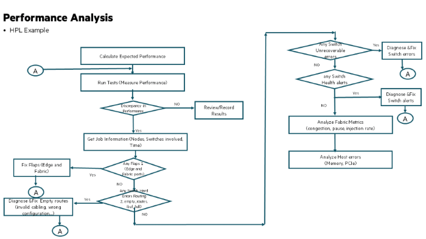

# Analyzing HPL benchmark performance issues

A set of nodes that are validated systematically as described in earlier sections is eligible for running applications.
The following is a high-level workflow for troubleshooting and getting insights into application hang, performance issues, or any failure due to fabric issues during the execution of fabric validation tests and applications.

There are different reasons why an application could be impacted and can have performance issues, such as the following:

- Hardware issues at node level
- Software issues at node level
- Fabric issues (due to NIC or fabric events)



Consider a scenario where an HPL application running for multiple hours has reported slowness at various times during the run.
For example, the following are some example timestamps at which the application recorded slowness.

```screen
slowness (ms) Time
1960.2 13:03:53.08
2105.8 13:20:01.00
13670.4 13:24:01.48
18942.9 13:26:46.71
14499.8 13:30:07.93
13725.9 13:33:36.02
13792.4 13:36:47.54
```

The following subsections have an analysis of application slowdown.

## Edge link flaps

Any Edge link (HSN) flap may result in a performance variation and slowdown, and in this case, one of the NICs had flapped during the test.
The Slingshot HSN NIC has built-in logic to ensure that lost packets are retransmitted. The slowness due to flap in this case has been observed as 32 seconds.

```screen
18942.9 13:26:46.71 !!!CXI flap
    x4207c7s5b0n0:[Wed Nov  8 13:26:51 2023] cxi_core 0000:c3:00.0: cxi3[hsn3] CXI_EVENT_LINK_DOWN
14499.8 13:30:07.93 !!!CXI flap
x4207c7s5b0n0:[Wed Nov  8 13:30:16 2023] cxi_core 0000:c3:00.0: cxi3[hsn3] CXI_EVENT_LINK_DOWN
```

**Note:** See the _HPE Slingshot Troubleshooting Guide_ to understand more on how to detect an edge link flap and correct the same.

## Fabric link flaps

Fabric Link flaps (Local and Global) may cause performance variation and slowdown during HPL application.
In this case there were no fabric link flaps.

**Note:** See the _HPE Slingshot Troubleshooting Guide_ to understand more on how to detect a fabric link flap and correct the same.

## Fabric errors

Fabric errors due to routing (software) or any switch buffer overflow can result in slowness.
In this case there were no `empty_route` (packet drops) or buffer overflow (ibuf) errors observed at the switch.

**Note:** See the _HPE Slingshot Troubleshooting Guide_ to understand more on how to detect fabric errors and correct the same.

## Switch hardware errors

Any switch unrecoverable errors can also cause application slowdown.
This will show up as an alert in the Fabric Manager Health alerts. In this case there were no switch alerts.

**Note:** See the _HPE Slingshot Troubleshooting Guide_ to understand more on health alerts.

## Hardware errors

The following is an extract of hardware errors from the console logs from various nodes.

```screen
Classification of Slowdowns
x4115c7s4b0n0:[Wed Nov  8 13:03:59 2023] {4}[Hardware Error]:   section_type: memory error
2105.8 13:20:01.00 !!! general processor error
x4010c1s4b0n0:[Wed Nov  8 13:20:12 2023] {1}[Hardware Error]:  section_type: general processor error
13670.4 13:24:01.48 !!! memory error
x4205c3s6b0n0:[Wed Nov  8 13:24:07 2023] {1}[Hardware Error]:  fru_text: Card02, ChnD, DIMM0
x4205c3s6b0n0:[Wed Nov  8 13:24:07 2023] {1}[Hardware Error]:   DIMM location: NODE 5 CPU1_DIMM_D1
x4205c3s6b0n0:[Wed Nov  8 13:24:07 2023] {1}[Hardware Error]:  fru_text: Card02, ChnD, DIMM0
x4205c3s6b0n0:[Wed Nov  8 13:24:07 2023] {1}[Hardware Error]:   DIMM location: NODE 5 CPU1_DIMM_D1
13725.9 13:33:36.02 !!! Memory error
x4205c3s6b0n0:[Wed Nov  8 13:33:41 2023] {2}[Hardware Error]:   section_type: memory error
x4205c3s6b0n0:[Wed Nov  8 13:33:41 2023] {2}[Hardware Error]:   section_type: memory error
x4205c3s6b0n0:[Wed Nov  8 13:33:41 2023] {2}[Hardware Error]:   section_type: memory error
x4205c3s6b0n0:[Wed Nov  8 13:33:41 2023] {2}[Hardware Error]:   section_type: memory error
x4205c3s6b0n0:[Wed Nov  8 13:33:41 2023] {2}[Hardware Error]:   section_type: memory error
x4205c3s6b0n0:[Wed Nov  8 13:33:41 2023] {2}[Hardware Error]:   section_type: memory error
x4205c3s6b0n0:[Wed Nov  8 13:33:41 2023] {2}[Hardware Error]:   section_type: memory error
x4205c3s6b0n0:[Wed Nov  8 13:33:41 2023] {2}[Hardware Error]:   section_type: memory error
13792.4 13:36:47.54 !!!memory error
x4205c3s6b0n0:[Wed Nov  8 13:36:53 2023] {3}[Hardware Error]:   section_type: memory error
x4205c3s6b0n0:[Wed Nov  8 13:36:53 2023] {3}[Hardware Error]:   section_type: memory error
x4205c3s6b0n0:[Wed Nov  8 13:36:53 2023] {3}[Hardware Error]:   section_type: memory error
x4205c3s6b0n0:[Wed Nov  8 13:36:53 2023] {3}[Hardware Error]:   section_type: memory error
x4205c3s6b0n0:[Wed Nov  8 13:36:53 2023] {3}[Hardware Error]:   section_type: memory error
x4205c3s6b0n0:[Wed Nov  8 13:36:53 2023] {3}[Hardware Error]:   section_type: memory error
x4205c3s6b0n0:[Wed Nov  8 13:36:53 2023] {3}[Hardware Error]:   section_type: memory error
x4205c3s6b0n0:[Wed Nov  8 13:36:53 2023] {3}[Hardware Error]:   section_type: memory error

Slowdown due to Hardware events: 42 seconds
```
