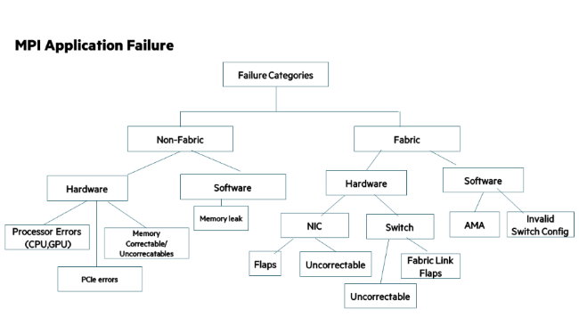

# Troubleshooting

This section includes examples for different scenarios of application failure.
Failure could be related to multiple factors.
The different categories and reasons for application failure are shown in the following figure.

