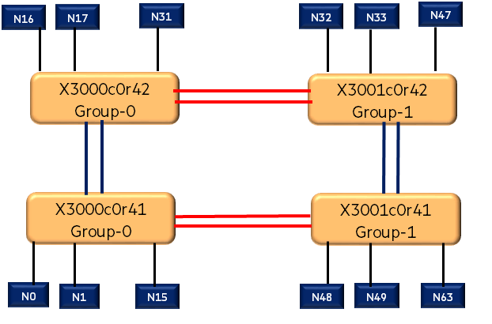

# Analyzing Congestion and Lossless Frames in HSN Fabric with the Slingshot Topology Tool (STT)

## Step-1: Understand the Fabric Topology (Global and Local links)

It is important to understand the Fabric Topology and the global and Local Links.
fmctl can be used to get the various fabric links (global and local). An example topology is shown in the figure.



```screen
fm-1# fmctl get topology-maps/template-map
+-----------------------------+-------------------------------------------------+
|             KEY             |                      VALUE                      |
+-----------------------------+-------------------------------------------------+
| documentSelfLink            | /fabric/topology-maps/template-map              |
| edgePortChange              | true                                            |
| fabricPortChange            | true                                            |
| fabricStatus                | map[edgePortStateMap:map[x3000c0r41j15p0:ONLINE |
|                             | x3000c0r41j15p1:ONLINE x3000c0r41j16p0:ONLINE   |
|                             | x3000c0r41j16p1:ONLINE x3000c0r41j17p0:ONLINE   |
|                             | x3000c0r41j17p1:ONLINE x3000c0r41j18p0:ONLINE   |
|                             | x3000c0r41j18p1:ONLINE x3000c0r41j19p0:ONLINE   |
|                             | x3000c0r41j19p1:ONLINE x3000c0r41j20p0:ONLINE   |
|                             | x3000c0r41j20p1:ONLINE x3000c0r41j21p0:ONLINE   |
|                             | x3000c0r41j21p1:ONLINE x3000c0r41j22p0:ONLINE   |
|                             | x3000c0r41j22p1:ONLINE x3000c0r41j23p0:ONLINE   |
|                             | x3000c0r41j23p1:ONLINE x3000c0r41j24p0:ONLINE   |
|                             | x3000c0r41j24p1:ONLINE x3000c0r41j25p0:ONLINE   |
|                             | x3000c0r41j25p1:ONLINE x3000c0r41j26p0:ONLINE   |
|                             | x3000c0r41j26p1:ONLINE x3000c0r41j27p0:ONLINE   |
|                             | x3000c0r41j27p1:ONLINE x3000c0r41j28p0:ONLINE   |
|                             | x3000c0r41j28p1:ONLINE x3000c0r41j29p0:ONLINE   |
|                             | x3000c0r41j29p1:ONLINE x3000c0r41j30p0:ONLINE   |
|                             | x3000c0r41j30p1:ONLINE] enabled:ONLINE          |
|                             | fabricPortStateMap:map[x3000c0r41j11p0:ONLINE   |
|                             | x3000c0r41j11p1:ONLINE x3000c0r41j12p0:ONLINE   |
|                             | x3000c0r41j12p1:ONLINE x3000c0r41j13p0:ONLINE   |
|                             | x3000c0r41j13p1:ONLINE x3000c0r41j14p0:ONLINE   |
|                             | x3000c0r41j14p1:ONLINE x3000c0r41j31p0:ONLINE   |
|                             | x3000c0r41j31p1:ONLINE x3000c0r41j32p0:ONLINE   |
|                             | x3000c0r41j32p1:ONLINE]                         |
|                             | switchLink:/fabric/switches/x3000c0r41b0]       |
|                           1 | map[edgePortStateMap:map[x3000c0r42j10p0:ONLINE |
|                             | x3000c0r42j10p1:ONLINE x3000c0r42j11p0:ONLINE   |
|                             | x3000c0r42j11p1:ONLINE x3000c0r42j12p0:ONLINE   |
|                             | x3000c0r42j12p1:ONLINE x3000c0r42j13p0:ONLINE   |
|                             | x3000c0r42j13p1:ONLINE x3000c0r42j14p0:ONLINE   |
|                             | x3000c0r42j14p1:ONLINE x3000c0r42j15p0:ONLINE   |
|                             | x3000c0r42j15p1:ONLINE x3000c0r42j17p0:ONLINE   |
|                             | x3000c0r42j17p1:ONLINE x3000c0r42j19p0:ONLINE   |
|                             | x3000c0r42j19p1:ONLINE x3000c0r42j1p0:ONLINE    |
|                             | x3000c0r42j1p1:ONLINE x3000c0r42j3p0:ONLINE     |
|                             | x3000c0r42j3p1:ONLINE x3000c0r42j4p0:ONLINE     |
|                             | x3000c0r42j4p1:ONLINE x3000c0r42j5p0:ONLINE     |
|                             | x3000c0r42j5p1:ONLINE x3000c0r42j6p0:ONLINE     |
|                             | x3000c0r42j6p1:ONLINE x3000c0r42j7p0:ONLINE     |
|                             | x3000c0r42j7p1:ONLINE x3000c0r42j8p0:ONLINE     |
|                             | x3000c0r42j8p1:ONLINE x3000c0r42j9p0:ONLINE     |
|                             | x3000c0r42j9p1:ONLINE] enabled:ONLINE           |
|                             | fabricPortStateMap:map[x3000c0r42j16p0:ONLINE   |
|                             | x3000c0r42j16p1:ONLINE                          |
|                             | x3000c0r42j18p0:ONLINE x3000c0r42j18p1:ONLINE   |
|                             | x3000c0r42j20p0:ONLINE x3000c0r42j20p1:ONLINE   |
|                             | x3000c0r42j21p0:ONLINE x3000c0r42j21p1:ONLINE   |
|                             | x3000c0r42j22p0:ONLINE x3000c0r42j22p1:ONLINE   |
|                             | x3000c0r42j2p0:ONLINE x3000c0r42j2p1:ONLINE]    |
|                             | switchLink:/fabric/switches/x3000c0r42b0]       |
|                           2 | map[edgePortStateMap:map[x3001c0r41j15p0:ONLINE |
|                             | x3001c0r41j15p1:ONLINE x3001c0r41j16p0:ONLINE   |
|                             | x3001c0r41j16p1:ONLINE x3001c0r41j17p0:ONLINE   |
|                             | x3001c0r41j17p1:ONLINE x3001c0r41j18p0:ONLINE   |
|                             | x3001c0r41j18p1:ONLINE x3001c0r41j19p0:ONLINE   |
|                             | x3001c0r41j19p1:ONLINE x3001c0r41j20p0:ONLINE   |
|                             | x3001c0r41j20p1:ONLINE x3001c0r41j21p0:ONLINE   |
|                             | x3001c0r41j21p1:ONLINE x3001c0r41j22p0:ONLINE   |
|                             | x3001c0r41j22p1:ONLINE x3001c0r41j23p0:ONLINE   |
|                             | x3001c0r41j23p1:ONLINE x3001c0r41j24p0:ONLINE   |
|                             | x3001c0r41j24p1:ONLINE x3001c0r41j25p0:ONLINE   |
|                             | x3001c0r41j25p1:ONLINE x3001c0r41j26p0:ONLINE   |
|                             | x3001c0r41j26p1:ONLINE x3001c0r41j27p0:ONLINE   |
|                             | x3001c0r41j27p1:ONLINE x3001c0r41j28p0:ONLINE   |
|                             | x3001c0r41j28p1:ONLINE x3001c0r41j29p0:ONLINE   |
|                             | x3001c0r41j29p1:ONLINE x3001c0r41j30p0:ONLINE   |
|                             | x3001c0r41j30p1:ONLINE] enabled:ONLINE          |
|                             | fabricPortStateMap:map[x3001c0r41j11p0:ONLINE   |
|                             | x3001c0r41j11p1:ONLINE x3001c0r41j12p0:ONLINE   |
|                             | x3001c0r41j12p1:ONLINE x3001c0r41j13p0:ONLINE   |
|                             | x3001c0r41j13p1:ONLINE x3001c0r41j14p0:ONLINE   |
|                             | x3001c0r41j14p1:ONLINE x3001c0r41j31p0:ONLINE   |
|                             | x3001c0r41j31p1:ONLINE x3001c0r41j32p0:ONLINE   |
|                             | x3001c0r41j32p1:ONLINE]                         |
|                             | switchLink:/fabric/switches/x3001c0r41b0]       |
|                           3 | map[edgePortStateMap:map[x3001c0r42j10p0:ONLINE |
|                             | x3001c0r42j10p1:ONLINE x3001c0r42j11p0:ONLINE   |
|                             | x3001c0r42j11p1:ONLINE x3001c0r42j12p0:ONLINE   |
|                             | x3001c0r42j12p1:ONLINE x3001c0r42j13p0:ONLINE   |
|                             | x3001c0r42j13p1:ONLINE x3001c0r42j14p0:ONLINE   |
|                             | x3001c0r42j14p1:ONLINE x3001c0r42j15p0:ONLINE   |
|                             | x3001c0r42j15p1:ONLINE x3001c0r42j17p0:ONLINE   |
|                             | x3001c0r42j17p1:ONLINE x3001c0r42j19p0:ONLINE   |
|                             | x3001c0r42j19p1:ONLINE x3001c0r42j1p0:ONLINE    |
|                             | x3001c0r42j1p1:ONLINE x3001c0r42j3p0:ONLINE     |
|                             | x3001c0r42j3p1:ONLINE x3001c0r42j4p0:ONLINE     |
|                             | x3001c0r42j4p1:ONLINE x3001c0r42j5p0:ONLINE     |
|                             | x3001c0r42j5p1:ONLINE x3001c0r42j6p0:ONLINE     |
|                             | x3001c0r42j6p1:ONLINE x3001c0r42j7p0:ONLINE     |
|                             | x3001c0r42j7p1:ONLINE x3001c0r42j8p0:ONLINE     |
|                             | x3001c0r42j8p1:ONLINE x3001c0r42j9p0:ONLINE     |
|                             | x3001c0r42j9p1:ONLINE] enabled:ONLINE           |
|                             | fabricPortStateMap:map[x3001c0r42j16p0:ONLINE   |
|                             | x3001c0r42j16p1:ONLINE                          |
|                             | x3001c0r42j18p0:ONLINE x3001c0r42j18p1:ONLINE   |
|                             | x3001c0r42j20p0:ONLINE x3001c0r42j20p1:ONLINE   |
|                             | x3001c0r42j21p0:ONLINE x3001c0r42j21p1:ONLINE   |
|                             | x3001c0r42j22p0:ONLINE x3001c0r42j22p1:ONLINE   |
|                             | x3001c0r42j2p0:ONLINE x3001c0r42j2p1:ONLINE]    |
|                             | switchLink:/fabric/switches/x3001c0r42b0]       |
| sweepIntervalInMilliseconds |                                           10000 |
+-----------------------------+-------------------------------------------------+


fm-1# fmctl get /fabric/topology-maps/template-map  --raw | jq '.fabricStatus[].fabricPortStateMap '
{
  "x3000c0r41j31p0": "ONLINE",
  "x3000c0r41j11p1": "ONLINE",
  "x3000c0r41j12p0": "ONLINE",
  "x3000c0r41j12p1": "ONLINE",
  "x3000c0r41j13p0": "ONLINE",
  "x3000c0r41j32p1": "ONLINE",
  "x3000c0r41j11p0": "ONLINE",
  "x3000c0r41j31p1": "ONLINE",
  "x3000c0r41j32p0": "ONLINE",
  "x3000c0r41j13p1": "ONLINE",
  "x3000c0r41j14p0": "ONLINE",
  "x3000c0r41j14p1": "ONLINE"
}
{
  "x3000c0r42j22p1": "ONLINE",
  "x3000c0r42j22p0": "ONLINE",
  "x3000c0r42j21p1": "ONLINE",
  "x3000c0r42j21p0": "ONLINE",
  "x3000c0r42j20p1": "ONLINE",
  "x3000c0r42j20p0": "ONLINE",
  "x3000c0r42j18p1": "ONLINE",
  "x3000c0r42j18p0": "ONLINE",
  "x3000c0r42j16p1": "ONLINE",
  "x3000c0r42j16p0": "ONLINE",
  "x3000c0r42j2p1": "ONLINE",
  "x3000c0r42j2p0": "ONLINE"
}
{
  "x3001c0r41j11p1": "ONLINE",
  "x3001c0r41j12p0": "ONLINE",
  "x3001c0r41j11p0": "ONLINE",
  "x3001c0r41j31p0": "ONLINE",
  "x3001c0r41j31p1": "ONLINE",
  "x3001c0r41j32p0": "ONLINE",
  "x3001c0r41j14p1": "ONLINE",
  "x3001c0r41j32p1": "ONLINE",
  "x3001c0r41j13p1": "ONLINE",
  "x3001c0r41j14p0": "ONLINE",
  "x3001c0r41j12p1": "ONLINE",
  "x3001c0r41j13p0": "ONLINE"
}
{
  "x3001c0r42j18p0": "ONLINE",
  "x3001c0r42j18p1": "ONLINE",
  "x3001c0r42j2p1": "ONLINE",
  "x3001c0r42j16p0": "ONLINE",
  "x3001c0r42j2p0": "ONLINE",
  "x3001c0r42j16p1": "ONLINE",
  "x3001c0r42j21p0": "ONLINE",
  "x3001c0r42j20p1": "ONLINE",
  "x3001c0r42j21p1": "ONLINE",
  "x3001c0r42j22p0": "ONLINE",
  "x3001c0r42j22p1": "ONLINE",
  "x3001c0r42j20p0": "ONLINE"
}

fm-1# fmctl get links
+---------------+-----------------------------------------------+
|      KEY      |                     VALUE                     |
+---------------+-----------------------------------------------+
| documentCount |                                            24 |
| documentLinks | /fabric/links/x3000c0r41j11p1-x3000c0r42j18p1 |
|             1 | /fabric/links/x3000c0r41j11p0-x3000c0r42j18p0 |
|             2 | /fabric/links/x3000c0r41j12p1-x3000c0r42j22p1 |
|             3 | /fabric/links/x3000c0r41j12p0-x3000c0r42j22p0 |
|             4 | /fabric/links/x3000c0r41j13p1-x3001c0r41j31p1 |
|             5 | /fabric/links/x3000c0r41j13p0-x3001c0r41j31p0 |
|             6 | /fabric/links/x3000c0r41j14p1-x3001c0r41j32p1 |
|             7 | /fabric/links/x3000c0r41j14p0-x3001c0r41j32p0 |
|             8 | /fabric/links/x3000c0r41j31p1-x3000c0r42j21p1 |
|             9 | /fabric/links/x3000c0r41j31p0-x3000c0r42j21p0 |
|            10 | /fabric/links/x3000c0r41j32p1-x3000c0r42j20p1 |
|            11 | /fabric/links/x3000c0r41j32p0-x3000c0r42j20p0 |
|            12 | /fabric/links/x3000c0r42j16p1-x3001c0r42j21p1 |
|            13 | /fabric/links/x3000c0r42j16p0-x3001c0r42j21p0 |
|            14 | /fabric/links/x3000c0r42j2p1-x3001c0r42j16p1  |
|            15 | /fabric/links/x3000c0r42j2p0-x3001c0r42j16p0  |
|            16 | /fabric/links/x3001c0r41j11p1-x3001c0r42j18p1 |
|            17 | /fabric/links/x3001c0r41j11p0-x3001c0r42j18p0 |
|            18 | /fabric/links/x3001c0r41j12p1-x3001c0r42j22p1 |
|            19 | /fabric/links/x3001c0r41j12p0-x3001c0r42j22p0 |
|            20 | /fabric/links/x3001c0r41j13p1-x3001c0r42j2p1  |
|            21 | /fabric/links/x3001c0r41j13p0-x3001c0r42j2p0  |
|            22 | /fabric/links/x3001c0r41j14p1-x3001c0r42j20p1 |
|            23 | /fabric/links/x3001c0r41j14p0-x3001c0r42j20p0 |
| totalCount    |                                            24 |
+---------------+-----------------------------------------------+


```

## Step-2: Data Collection before tests

 STT commands can be used to get a top-down view of the fabric and to understand the performance issues due to underlying Fabric issues. In a large topology collecting data for the entire fabric switches could be time consuming. It is recommended to collect the tests on particular switches and ports that are involved in the tests.

**Example: **

In this example , performance tests are conducted between the edge nodes that are connected to `x3000c0r41` and `x3001c0r41`.
Counters at switch level are collected as shown below

```screen
fm-1# slingshot-topology-tool --cmd "show switches" >> show_switches-before
fm-1# slingshot-topology-tool --cmd "show switch counters x3000c0r41" >> x3000c0r41_counters-before
fm-1# slingshot-topology-tool --cmd "show switch counters x3001c0r41" >> x3001c0r41_counters-before
fm-1# slingshot-topology-tool --cmd "show switch perfcounters x3000c0r41" >> x3000c0r41_perfcounters-before
fm-1# slingshot-topology-tool --cmd "show switch perfcounters x3001c0r41" >> x3001c0r41_perfcounters-before
```

Counters at the Fabric Ports are collected as shown below.

```screen
fm-1# slingshot-topology-tool --cmd "show switch perfcounters x3000c0r41j13p0" >> x3000c0r41j13p0_perfcounters-before
fm-1# slingshot-topology-tool --cmd "show switch perfcounters x3001c0r41j31p1" >> x3001c0r41j31p1_perfcounters-before
fm-1# slingshot-topology-tool --cmd "show switch counters x3001c0r41j31p1" >> x3001c0r41j31p1_counters-before
fm-1# slingshot-topology-tool --cmd "show switch counters x3000c0r41j13p0" >> x3000c0r41j13p0_counters-before
```

## Step-3: Perform the tests/Run the application

## Step-4: Data Collection after tests

```screen
fm-1# slingshot-topology-tool --cmd "show switches" >> show_switches-after
fm-1# slingshot-topology-tool --cmd "show switch counters x3000c0r41" >> x3000c0r41_counters-after
fm-1# slingshot-topology-tool --cmd "show switch counters x3001c0r41" >> x3001c0r41_counters-after
fm-1# slingshot-topology-tool --cmd "show switch perfcounters x3000c0r41" >> x3000c0r41_perfcounters-after
fm-1# slingshot-topology-tool --cmd "show switch perfcounters x3001c0r41" >> x3001c0r41_perfcounters-after
```

Counters at the Fabric Ports are collected as shown below.

```screen
fm-1# slingshot-topology-tool --cmd "show switch perfcounters x3000c0r41j13p0" >> x3000c0r41j13p0_perfcounters-after
fm-1# slingshot-topology-tool --cmd "show switch perfcounters x3001c0r41j31p1" >> x3001c0r41j31p1_perfcounters-after
fm-1# slingshot-topology-tool --cmd "show switch counters x3001c0r41j31p1" >> x3001c0r41j31p1_counters-after
fm-1# slingshot-topology-tool --cmd "show switch counters x3000c0r41j13p0" >> x3000c0r41j13p0_counters-after
```

## Step-5: Analysis of Data collected for Congestion

Counters that are relevant for congestion and drops have been explained in earlier sections.
In this step look for any significant drops and discards in the counters of the fabric ports that are involved in the test.

```screen
fm-1# cat x3001c0r41j31p1_perfcounters
Using Fabric Manager URL http://localhost:8000
STT diags log directory -  /root/resiliency_tests/gdit/passive/stt_diags_logs
STT diags log directory -  /root/resiliency_tests/gdit/passive/stt_diags_logs/default
Loading  point2point file /opt/cray/etc/sct/Shasta_system_hsn_pt_pt.csv to default topology
Loading fabric template file /opt/cray/fabric_template.json to default topology

Working with 'default' topology and 'default' filter profile.
STT diags log directory -  /root/resiliency_tests/gdit/passive/stt_diags_logs/switch_topo_x3001c0r41
Collecting data using 'dgrperfcheck' script.
dgrperfcheck  :  Start time: 07/12/2021, 06:04:22 , End time: 07/12/2021, 06:04:25
port 48 Slingshot switch perf counters:
{
    "IFCT_MULTICAST_FRAMES_A": 0,
    "IFCT_MULTICAST_FRAMES_B": 0,
    "NUM_DROPS_DISCARDS_FULL_BUFFERS": 0,
    "NUM_IFCT_NOT_ZERO": 0,
    "ROSEVC_AGEQ_HWM_DISCARD_ERR": 0,
    "ROSEVC_AGEQ_HWM_DISCARD_INFO": 0,
    "ROSEVC_AGEQ_SIZE_DISCARD_ERR": 0,
    "ROSEVC_AGEQ_TO_DISCARD_ERR": 0,
    "ROSEVC_AGEQ_TO_DISCARD_INFO": 0,
    "ROSEVC_EEG_TRAP_DROP_EOPB": 0,
    "ROSEVC_EEG_TRAP_DROP_FULL": 0,
    "ROSEVC_IBUF_IBUF_FULL": 0,
    "ROSEVC_IFCT_ALWAYS_DISCARD": 0,
    "ROSEVC_IFCT_ALWAYS_FQ_DROP_A": 0,
    "ROSEVC_IFCT_ALWAYS_FQ_DROP_B": 0,
    "ROSEVC_IFCT_ALWAYS_PCP_DROP_A": 0,
    "ROSEVC_IFCT_ALWAYS_PCP_DROP_B": 0,
    "ROSEVC_IFCT_FC_DQ_DISCARD": 0,
    "ROSEVC_IFCT_RANDOM_FQ_DROP_A": 0,
    "ROSEVC_IFCT_RANDOM_FQ_DROP_B": 0,
    "ROSEVC_IFCT_RANDOM_PCP_DROP_A": 0,
    "ROSEVC_IFCT_RANDOM_PCP_DROP_B": 0,
    "ROSEVC_INQ_ECN_DROPPED": 0,
    "ROSEVC_LLR_TX_DISCARD": 0,
    "ROSEVC_OBUF_DROP_FLT": 0,
    "ROSEVC_OBUF_DROP_FRM": 0,
    "ROSEVC_OFCT_DISCARD_FORWARD_BLOCK": 0,
    "ROSEVC_OFCT_EPC1_ACKS_DROPPED": 0,
    "ROSEVC_OFCT_FABRIC_DISCARD_ACKS": 0,
    "ROSEVC_OFCT_FINAL_DISCARD_ACKS": 0,
    "ROSEVC_RED_DATA_DROP": 0
}

fm-1# cat x3001c0r41j31p1_counters
Using Fabric Manager URL http://localhost:8000
STT diags log directory -  /root/resiliency_tests/gdit/passive/stt_diags_logs
STT diags log directory -  /root/resiliency_tests/gdit/passive/stt_diags_logs/default
Loading  point2point file /opt/cray/etc/sct/Shasta_system_hsn_pt_pt.csv to default topology
Loading fabric template file /opt/cray/fabric_template.json to default topology

Working with 'default' topology and 'default' filter profile.
STT diags log directory -  /root/resiliency_tests/gdit/passive/stt_diags_logs/switch_topo_x3001c0r41
Collecting data using 'dgrerrstat' script.
dgrerrstat  :  Start time: 07/12/2021, 06:04:55 , End time: 07/12/2021, 06:05:00
48 Slingshot switch counters:
{
    "ageq_gnt_sq_00": 335272,
    "ageq_gnt_vc_00": 335272,
    "ageq_histogram_00": 844608336273209,
    "ageq_histogram_16": 844608336309145,
    "eeg_itf_sts_rx_ok": 57930440487884,
    "eeg_trap_cdt": 1341088,
    "eeg_trap_flits": 1341088,
    "eeg_trap_frames": 335272,
    "eeg_trap_rx_pkt_ack": 335272,
    "eeg_trap_rx_pkt_done": 335272,
    "ibuf_gnt_empty": 844608335580133,
    "ibuf_op_idle": 844608335584569,
    "ibuf_pkt_ctl": 981871870953,
    "itf_rx_ok_36_to_63": 981871872521,
    "itf_rx_ok_opt": 981871872473,
    "llr_rx_ack_ctl_os": 9622444596324,
    "llr_rx_init_ctl_os": 497010,
    "llr_rx_init_echo_ctl_os": 1,
    "llr_rx_loop_time_req_ctl_fr": 38498,
    "llr_rx_loop_time_rsp_ctl_fr": 37069,
    "llr_rx_ok_lossy": 981871947924,
    "llr_tx_ack_ctl_os": 9622363176242,
    "llr_tx_init_ctl_os": 1,
    "llr_tx_init_echo_ctl_os": 1,
    "llr_tx_loop_time_req_ctl_fr": 37435,
    "llr_tx_loop_time_rsp_ctl_fr": 37070,
    "llr_tx_ok_bypass": 981850125634,
    "llr_tx_ok_lossy": 74505,
    "obuf_cftx_by_frm": 981850125495,
    "obuf_cftx_by_stl": 2355,
    "obuf_efct_ack": 335272,
    "obuf_efifo_flt": 1341088,
    "obuf_efifo_frm": 335272,
    "obuf_efifo_stl": 1224,
    "obuf_ftag_flits": 1341088,
    "obuf_per_sq_flits_00": 1341088,
    "obuf_rcvd_flt": 1341088,
    "obuf_rcvd_frm": 335272,
    "obuf_sent_flt": 1963701592106,
    "obuf_sent_frm": 981850460778,
    "ofct_cycles_n_flows_allocated_0": 844608336120493,
    "ofct_final_epc2_acks": 335272,
    "ofct_locally_term_hdrs": 335272,
    "ofct_no_flow_hdrs": 335272,
    "ofct_no_of_grants": 335272
}
```

