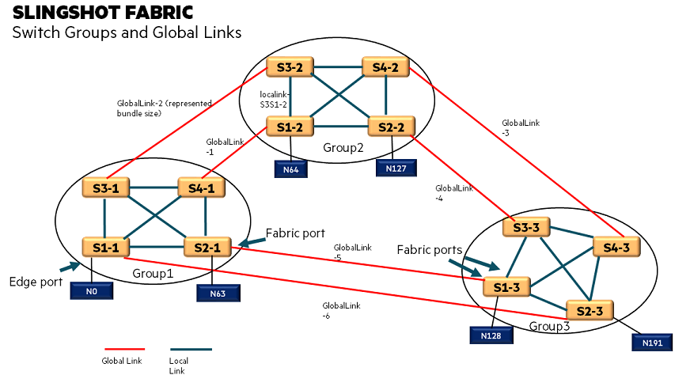
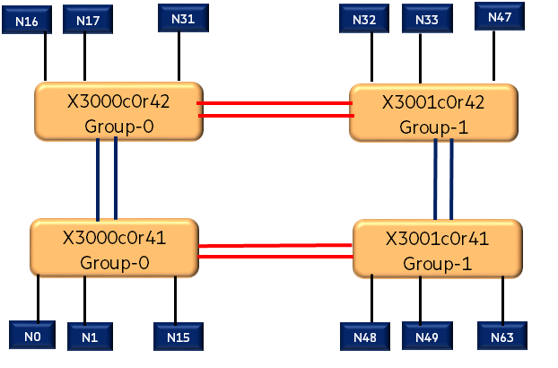

# Congestion Management

Slingshot network uniquely addresses the congestion challenges of short-lived, small packet flows typical in HPC applications. In hardware, each switch detects congestion, identifies its causes, and provides real-time feedback to its peers. The system distinguishes perpetrators from victims of injection and limits the injection rate from the perpetrator until congestion clears. Several hardware mechanisms are utilized to significantly reduce congestion within the network as well as to
limit the saturation tree within the network when problems arise.

## Causes for Congestion

* Congestion can be caused by the underlying architecture of the network. Very few, if any, systems are configured with maximum global bandwidth. As a result of the global network taper, there is inherently more injection bandwidth into the network than can be globally consumed. As a result, global congestion results when applications provide a heavy global communication load.
* Congestion can also be caused by interactions between jobs. Various traffic patterns can have negative impact on concurrent jobs resulting in reduced performance for those jobs competing for the congested resources.
* Congestion can also be caused by poor programming practices. All-to-one communication inherently causes congestion as the injection bandwidth far exceeds the ejection bandwidth. In these cases, the aim is to limit the congestion damage to only those processes involved in the all-to-one communication and not allow that congestion to propagate and affect other jobs in the system.
* Congestion can be caused by hardware failures which reduce the network's bandwidth capacities in a limited area of the system.

## Congestion Measurement

Measuring congestion is therefore critical in determining the course of action. Slingshot adopts multiple techniques to internally measure and dynamically adapt to congestion.
Slingshot adopts real-time measurements of the congestion parameters mentioned. Appropriate actions are taken to avoid further congestion or to eliminate the congestion entirely.

* Local congestion. This is congestion within a switch chip that can be observed through buffer utilization. It is also an indication of the link utilization of that local port.
* Global congestion. This is understanding the global congestion picture and the “hot spots” that the traffic encountered on its path to the destination

## Congestion Information Distribution

* Local congestion (that within a switch itself) is distributed to all the local inputs through on-board hardware. Slingshot adopts highly dynamic, low latency distribution mechanisms and allows for the route pipe to select a lightly loaded port for its egress when appropriate.
* Switch to switch congestion information relays congestion of adjoining devices. This allows for a next-hop view of congestion to allow the adaptive routing mechanism to select a lightly loaded adjoining switch.
* Global congestion information is relayed through the back-channel acknowledgments that accompany the flow channels. This information notifies the flow that congestion was encountered along the path.
* In the case of inject vs. eject bandwidth mis-matches, the NIC itself must be throttled. This back pressure is a result of the back-channel acknowledgments and results in slowing the injection rate by the NIC to a suitable rate for the network to handle without congestion.

# Explicit Congestion Notification

Standard Ethernet uses Explicit Congestion Notification (ECN) to signal to applications that congestion may be occurring within a network. The ECN is a field within the IP header that first signals an application is capable of responding to congestion and can be modified by an Ethernet switch/router to signal that congestion is occurring. Usually the bit is modified when an input buffer is becoming full. Many TCP stacks can respond to forward ECN (FECN) marking in a similar way to a packet being dropped by signaling with the backwards TCP acknowledgment the transmitter to slow down. Often this is called the backwards ECN (BECN).

## Congestion Management Mechanisms

* Finding a free path through the network.
* Allowing only just enough frames into the fabric to achieve maximum bandwidth along its path.



The figure shown describes an example topology. The table provides the different types of routing that is dynamically employed by Slingshot depending on the congestion and its automatic congestion management mechanisms.

| Source | Destination | Hop-O | Hop-1 | Hop-2 | Hop-3 | Description                    |
|--------|-------------|-------|-------|-------|-------|--------------------------------|
| N0     | N63         | S1-1  | S2-1  |       |       | Local Minimal                  |
| N0     | N63         | S1-1  | S3-1  | S2-2  |       | Local Non-minimal              |
| N0     | N64         | S1-1  | S4-1  | S1-2  |       | Optimal                        |
| N0     | N64         | S1-1  | S3-1  | S3-2  | S1-2  | Adaptive Routing (global Link) |
| N0     | N64         | S1-1  | S2-1  | S4-1  | S1-2  | Adaptive Routing (Local link)  |

# Monitoring Fabric Health and Diagnostics

Slingshot hardware provides extensive fabric telemetry and monitoring capabilities for link state, port errors, and performance. The Fabric Manager supports comprehensive health checking, monitoring and logging, performance profiling, and diagnostics to enable highly available and effective operations with high performance. Event, error, and counter data is gathered from all devices in the network and available via REST APIs in JSON format. Data collection takes place out-of-band over the management network.
The Slingshot Fabric Manager includes a scalable set of telemetry services for collecting, storing, and acting on acquired data and alerts. Metrics data and state information are accessible directly for use using the telemetry service REST APIs.

# Telemetry Metrics and Counters

The Fabric Manager collects metrics and counters from the switch agents and controllers. It also generates fabric health metrics to track the running state of the system (Traffic, Congestion, & Runtime). Configure the Telemetry Endpoint for enabling the Telemetry for HSN (Refer to the operational guide)

All telemetry data is cached in the Fabric Manager and can be queried via odata queries. When querying via Odata query, the query can be filtered to select a category of metrics by using PhysicalContext = .Metric. For instance Congestion.rxBW.

The various type of telemetry data that can be used to analyze performance issues include the following:

**Cray Fabric Telemetry**

Cray Fabric Telemetry is telemetry data generated by the switch agents associated with port runtime information.

**Cray Fabric Performance Telemetry**

Cray Fabric Telemetry is telemetry data generated by the switch agents associated with per port utilization/congestion.
Congestion metrics are collected and posted based on a configurable periodic timer. The counters associated with RFCs
are optionally configurable and disabled by default. Enabling a category of RFC counters (e.g. RFC3635) enables collection
of all counters in the group.

**Cray Fabric Critical Telemetry**

Cray Fabric Critical Telemetry is telemetry data generated by the switch agents associated with critical port errors. These
errors are posted on occurrence. HardwareErrors are errors which should not occur and require immediate attention.

**Cray Fabric Health Telemetry**

Cray Fabric Health Telemetry is telemetry data generated by the fabric manager to track the health of the system. Fabric
Health events are posted on error occurrence as well as when the error clears and a healthy state is reached. These include
Traffic, Configuration and Runtime data.

**Accessing Telemetry data using OData query**

The metrics data can be viewed through the Fabric Manager API with OData query.syntax. Few examples of the query are given below

1. top:
top returns top numbers of metrics from the database. They are not guaranteed to be latest metrics unless the query is
combined with orderby timestamp in descending order.

    ```screen
    curl -LG 'http://{fmn-baseUrl}/metrics?$top=1' |jq
    {
    "totalCount": 1,
    "documentLinks": [
    "/metrics/e1ed54dc19deb6755b8ceb3cc4253"
    ],
    "documentCount": 1,
    "queryTimeMicros": 9000,
    13
    "documentVersion": 0,
    "documentUpdateTimeMicros": 0,
    "documentExpirationTimeMicros": 0,
    "documentOwner": "5d4eec49-1478-4807-a874-7a7ff885ce71"
    }
    ```

2. limit: limit returns number of metrics per page. You can navigate to the next or previous page by clicking the **nextPageLink** or
**prevPageLink**.

    ```screen
    curl -LG 'http://{fmn-baseUrl}/metrics?$limit=3'
    {
    "totalCount": 3,
    "documentLinks": [
    "/metrics/e1ed54dc19deb6755b8ceb3cc4253",
    "/metrics/e1ed54dc19deb6755b8ceb3cc462e",
    "/metrics/e1ed54dc19deb6755b8ceb3cc4637"
    ],
    "documentCount": 3,
    "nextPageLink": "/metrics?path=1610576732165000&peer=5d4eec49-1478-4807-a874-7a7ff885ce71",
    "queryTimeMicros": 5000,
    "documentVersion": 0,
    "documentUpdateTimeMicros": 0,
    "documentExpirationTimeMicros": 0,
    "documentOwner": "5d4eec49-1478-4807-a874-7a7ff885ce71"
    }
    ```

3. count:
count returns the total number of metrics of a query result.

    ```screen
    curl -LG 'http://{fmn-baseUrl}/metrics?$count=true'
    {
    "totalCount": 12490,
    "documentLinks": [],
    "documentCount": 12490,
    "queryTimeMicros": 66999,
    "documentVersion": 0,
    "documentUpdateTimeMicros": 0,
    "documentExpirationTimeMicros": 0,
    "documentOwner": "5d4eec49-1478-4807-a874-7a7ff885ce71"
    }
    ```

4. filter:
   filter returns a subset of metrics match criteria specified in query option.

    ```screen
    curl -LG 'http://{fmn-baseUrl}/metrics?$filter=Location%20eq%20%27x2006c0r39a0l1%27&$top=1'
    {
    "totalCount": 1,
    "documentLinks": [
    "/metrics/e1ed54dc19deb6755b8ceb3cc4253"
    ],
    "documentCount": 1,
    "queryTimeMicros": 6000,
    "documentVersion": 0,
    "documentUpdateTimeMicros": 0,
    "documentExpirationTimeMicros": 0,
    "documentOwner": "5d4eec49-1478-4807-a874-7a7ff885ce71"
    }
    ```

The above example uses the eq (equal) logical operator.

# Analyzing Congestion and HSN Fabric with STT (Slingshot Topology Tool)

The following STT commands can be used to get a top-down view of the fabric and to understand the performance issues due to underlying Fabric issues:

`**show switches**` This provides a high level view from the switches and any drops and discards that are happening at the switch level (aggregated from the ports of the switches)

`**show switch error_flags**`

This command provides any errors that are encountered by the switch

`**show links health**`

This command analyses the downed links and suggests a diagnostic action code based on information fetched from switches and edge nodes.

`**show switch counters**`

This command provides the different counters at the switch level which can be correlated with the performance benchmarking tests.

```screen
(STT) show switches

Working with 'default' topology and 'default' filter profile.
Collecting data using 'check-switches' script.
Collecting data using 'dgrerrstat' script.


check-switches  :  Start time: 04/29/2021, 04:22:27 , End time: 04/29/2021, 04:22:32
dgrperfcheck  :  Start time: 04/29/2021, 04:22:27 , End time: 04/29/2021, 04:22:32
dgrerrstat  :  Start time: 04/29/2021, 04:22:27 , End time: 04/29/2021, 04:22:33
+------------+----------+------+------+-------+---------+--------+----------+------+-----------+--------+--------+-------+--------+
|   xname    |   type   | snum | gnum | edge_ | fabric_ | uptime | up_ports | flap | checkidle | pktIn  | pktOut | drops | dscrds |
|            |          |      |      | count | count   |        |          |      |           |        |        |       |        |
+------------+----------+------+------+-------+---------+--------+----------+------+-----------+--------+--------+-------+--------+
| x3000c0r41 | Columbia |  0   |  0   |  32   |   12    | 1 day  |  35/64   |  0   |    idle   | 103244 | 105776 |   0   |  109   |
| x3000c0r42 | Columbia |  1   |  0   |  32   |   12    | 1 day  |  37/64   |  3   |    idle   | 108564 | 111253 |   0   |  109   |
| x3001c0r41 | Columbia |  0   |  1   |  32   |   12    | 1 day  |  42/64   |  0   |    idle   | 132428 | 135698 |   0   |  109   |
| x3001c0r42 | Columbia |  1   |  1   |  32   |   12    | 1 day  |  42/64   |  1   |    idle   | 136694 | 139855 |   0   |  113   |
+------------+----------+------+------+-------+---------+--------+----------+------+-----------+--------+--------+-------+--------+


```

**Summary of counters that are part of the "dscrds"**

**Ethernet Ingress Queues**

EIQ_SOP_FULL

This counter indicates the total number of IBUF Full indicators received. The headers for these will be discarded by the EIQ

**Input Buffer (IBUF)**

IBUF_SM_PORTALS_FCS_ERR

This counter indicates the total number of Fabric Format single flit (Small Portals or High Rate Puts) received and discarded due to an FCS-16 Error

IBUF_IBUF_FULL

This counter indicates the total number of packets discarded at input due to the IBUF being full (full response to EIQ)

IBUF_FAB_HCRC

This counter indicates the total number of Fabric Format multi-flit packets received and discarded due to an HCRC-16 error

IBUF_EIQ_FULL

This counter indicates the total number of packets discarded at input due to the EIQ being full

IBUF_REMLB_FULL

This counter indicates the total number of remote loop back packets discarded at input (when configured as lossy) - due to the IBUF being full

**Input Flow Channel Table (IFCT)**

IFCT_EMPTY_ROUTE

Count of frames that were discarded because the FRF returned an empty route

IFCT_FC_DQ_DISCARD

Count of frames that were discarded when the discard flag was set in the header. This could be an instruction from the Ethernet lookup (ACL function or unrecognized header), a broken frame (bad size, broken FCS, uncorrectable ECC, Etc), EIQ was full, the IBUF was full, or receiving a frame with an FTag that is currently being reconfigured in its distribution of APPG queues

IFCT_NO_FLOW_MCAST_ERROR

Count of multicast frames that were discarded because they had not been allocated a flow channel. Frames using multicast addressing but only selecting a single output port (E.g. reduction frames) will not be discarded or increment this count.


IFCT_ALWAYS_DISCARD

Count of frames that were discarded because the ALWAYS_DISCARD flag has been set in the FTag configuration CSR.

**Fabric Routing Function (FRF)**

FRF_EMPTY_ROUTE_UF_CNTR
This is an error counter that counts the number of unicast and sw_port frames that were dropped because they were unexpected.


FRF_EMPTY_ROUTE_EDGE_CNTR

This is an error counter that counts the number of unicast frames that were dropped because they were being routed to an edge port that was non-operational

FRF_MCAST_DROP_NON_OP_CNTR

This is an error counter that counts the number of multicast frames that were not routed to all of the non-edge ports that they were configured to be routed to because one or more non-edge ports were non-operational.

FRF_MCAST_DROP_EDGE_CNTR

This is an error counter that counts the number of multicast frames that were not routed to all of the edge ports that they were configured to be routed to because one or more edge ports were non-operational.

FRF_MCAST_EMPTY_ROUTE_CNTR

This is an error counter that counts the number of multicast frames that were dropped because there were no ports that the frame was able to be routed to. This counter is not incremented for frames that cause any of the other MCAST_EMPTY_ROUTE_ counters to increment

FRF_MCAST_DROP_VCE_CNTR

This is an error counter that counts the number of multicast frames that were not routed to all of the ports that they were configured to be routed to because the frame’s VC would have exceed the maximum allowed VC value one or more ports

FRF_MCAST_EMPTY_ROUTE_UMID_CNTR

This is an error counter that counts the number of multicast frames that were dropped because the multicast_id in their DFA was an unexpected value.

FRF_MCAST_EMPTY_ROUTE_VCE_CNTR

This is an error counter that counts the number of multicast frames that were dropped because the frame’s VC would have exceeded the maximum allowed VC value on all ports the frame was configured to be routed to.

FRF_MCAST_EMPTY_ROUTE_EDGE_CNTR

This is an error counter that counts the number of multicast frames that were dropped because all of the ports that the frame was configured to be routed to were non-operational edge ports

FRF_MCAST_EMPTY_ROUTE_CNTR

This is an error counter that counts the number of multicast frames that were dropped because there were no ports that the frame was able to be routed to. This counter is not incremented for frames that cause any of the other MCAST_EMPTY_ROUTE_ counters to increment.

FRF_MCAST_FRAMES_FILTERED_CNTR

This is a count of the number of multicast frames dropped due to the multicast filter function

**Age Queue (AGEQ)**

AGEQ_TO_DISCARD_ERR

This counter indicates the number of times a TO_DISCARD_ERR has occurred

AGEQ_HWM_DISCARD_ERR

This counter indicates the number of times a HWM_DISCARD_ERR has occurred

AGEQ_SIZE_DISCARD_ERR

This counter indicates the number of times a SIZE_DISCARD_ERR has occurred

**Output Buffer**

TF_OBUF_DROP_FRM

The counter indicates the number of frames dropped from the Elastic FIFO due to a bad header.

**REDUCTION ENGINE**

TF_RED_ARM_SEQ_ACTIVE

This counter indicates the number or reduction arm frames dropped because of the sequence number was already active

TF_RED_ARM_NO_DESC

This counter indicates the number of reduction arm frames dropped because no descriptors were available

TF_RED_DATA_DROP

This counter indicates the number of reduction data frames dropped because of an error (mismatch, frame format error, or descriptor just allocated

PF_MAC_RX_ILLEGAL_SIZE

This counter indicates that a frame with an illegal size has been received and filtered

PF_LLR_TX_DISCARD

This counter indicates the number of frames that have been discarded by the TX LLR

PF_RX_OK_FILTER_INGRESS

This counter indicates the number of frames received that were filtered by the VLAN state rules and with a good FCS

PF_RX_OK_FILTERED

This counter indicates the number of frames received that were filtered and with a good FCS

`show FabricTelemetry`

Provides Cray Fabric Telemetry counters which can be used to look at edge port status and issues due to edge connectivity.

`show hsn_traffic ping-all-to-all`

Performs all-to-all ping test between all the configured HSN interfaces of all HSN nodes as per p2p file or user provided comma separated HSN nodes. By default, only non-reachable nodes are listed. To get list of both reachable and non-reachable nodes, use 'detailed' option at end of command.

`show hsn_traffic roce_perf_check_loopback`

Performs RoCE (RDMA over Converged Ethernet) bandwidth and latency benchmark tests using `perftest` package on Mellanox5 devices at compute nodes port level. The bandwidth and latency tests operate on a single port and not cross-fabric routes. The test validates underlying software and hardware components between compute node port and Slingshot switch. This has been integrated to  'ib_read_bw', 'ib_read_lat', 'ib_write_bw' and 'ib_write_lat' benchmarks.

`show switch perfcounters`

This will list all the performance counters at the switch and port level. The counters *DISCARD* can be used to look for high discards that can be indicative of the congestion in the network.

**Procedure for troubleshooting issues during performance benchmarking**

STT can be used to perform analysis by capturing key metrics before and after performance benchmarking tests and by analyzing the data at switch level and port level admin can get more insights to any possible congestion or discards that can impact the performance

**Increasing SSH timeout value in STT**

On bigger systems, in order to avoid SSH connection timeouts while connecting to the switches/CNs through STT, timeout value can be increased
using the option `--ssh_conn_timeout` while launching the tool.

```screen
# slingshot-topology-tool --ssh_conn_timeout 60
Using Fabric Manager URL http://localhost:8000
STT diags log directory -  /root/abhilash/stt_diags_logs
STT diags log directory -  /root/abhilash/stt_diags_logs/default
Loading  point2point file /opt/cray/etc/sct/Shasta_system_hsn_pt_pt.csv to default topology
Loading fabric template file /opt/cray/fabric_template.json to default topology
Welcome to the Slingshot Topology Tool v1.2.1-5.
     General Usage is <command> <arguments>
     Type help or ? to list commands.

(STT)
```

**Example of Analysis switch discards during tests**

Steps:

1. Capture show switches output before tests (show-switches.t0)
2. Run the tests
3. Capture show switches output after tests  (show-switches.t1)

    ```screen
    fm-1# cat show-switches-stats.t0

    Using Fabric Manager URL http://localhost:8000
    STT diags log directory -  /root/stt_diags_logs
    STT diags log directory -  /root/stt_diags_logs/default
    Loading  point2point file /opt/cray/etc/sct/Shasta_system_hsn_pt_pt.csv to default topology
    Loading fabric template file /opt/cray/fabric_template.json to default topology

    Working with 'default' topology and 'default' filter profile.
    Collecting data using 'check-switches' script.
    Warning: login credentials for compute nodes is not set in STT.
    Use 'compute_nodes_creds' command to input compute node login credentials.

    Trying to access compute nodes without password using SSH.

    Collecting data using 'dgrerrstat' script.
    Collecting data using 'dgrperfcheck' script.
    dgrerrstat  :  Start time: 04/28/2021, 21:43:35 , End time: 04/28/2021, 21:45:46
    dgrperfcheck  :  Start time: 04/28/2021, 21:43:35 , End time: 04/28/2021, 21:45:49
    check-switches  :  Start time: 04/28/2021, 21:43:35 , End time: 04/28/2021, 21:47:38

    check-switches  :  Start time: 04/28/2021, 21:43:35 , End time: 04/28/2021, 21:47:38
    +------------+----------+------+------+------------+--------------+--------+----------+------+-----------+------+-----------+
    |   xname    |   type   | snum | gnum | edge_count | fabric_count | uptime | up_ports | flap | checkidle | drops|   dscrds  |
    +------------+----------+------+------+------------+--------------+--------+----------+------+-----------+------+-----------+
    | x1001c6r3  | Colorado |  9   |  5   |     16     |      40      | 3 days |  56/64   |  0   |     15    |  0   |     690   |
    | x1001c6r7  | Colorado |  6   |  5   |     16     |      40      | 3 days |  56/64   |  0   |    idle   |  0   |      54   |
    | x1001c7r3  | Colorado |  7   |  5   |     16     |      40      | 3 days |  56/64   |  3   |    idle   |  0   | 499553073 |
    | x1001c7r7  | Colorado |  8   |  5   |     16     |      40      | 3 days |  56/64   |  0   |    idle   |  0   |     578   |
    | x1002c0r3  | Colorado |  0   |  6   |     16     |      42      | 3 days |  57/64   |  13  |    idle   |  0   |15803474151|
    | x1004c7r7  | Colorado |  15  |  8   |     16     |      40      | 3 days |  54/64   |  7   |    idle   |  0   |  100556   |
    | x1005c0r3  | Colorado |  0   |  9   |     16     |      42      | 3 days |  58/64   |  6   |    idle   |  0   |2753519569 |
    | x1106c1r7  | Colorado |  1   |  12  |     16     |      42      | 3 days |  58/64   |  2   |    idle   |  0   |827622573  |

    * The output has been truncated for readability.

    fm-1# cat show-switches-stats.t1
    Using Fabric Manager URL http://localhost:8000
    STT diags log directory -  /root/stt_diags_logs
    STT diags log directory -  /root/stt_diags_logs/default
    Loading  point2point file /opt/cray/etc/sct/Shasta_system_hsn_pt_pt.csv to default topology
    Loading fabric template file /opt/cray/fabric_template.json to default topology

    Working with 'default' topology and 'default' filter profile.
    Collecting data using 'check-switches' script.
    Collecting data using 'dgrerrstat' script.
    Warning: login credentials for compute nodes is not set in STT.
    Use 'compute_nodes_creds' command to input compute node login credentials.
    Trying to access compute nodes without password using SSH.

    Collecting data using 'dgrperfcheck' script.
    dgrerrstat  :  Start time: 04/28/2021, 22:08:01 , End time: 04/28/2021, 22:10:07
    dgrperfcheck  :  Start time: 04/28/2021, 22:08:01 , End time: 04/28/2021, 22:10:13
    check-switches  :  Start time: 04/28/2021, 22:08:01 , End time: 04/28/2021, 22:11:55
    +------------+----------+------+------+------------+--------------+--------+----------+------+-----------+-------+------------+
    |   xname    |   type   | snum | gnum | edge_count | fabric_count | uptime | up_ports | flap | checkidle | drops |    dscrds  |
    +------------+----------+------+------+------------+--------------+--------+----------+------+-----------+-------+------------+
    | x1001c6r3  | Colorado |  9   |  5   |     16     |      40      | 3 days |  56/64   |  0   |    idle   |    0  |     690    |
    | x1001c6r7  | Colorado |  6   |  5   |     16     |      40      | 3 days |  56/64   |  0   |    idle   |    0  |      54    |
    | x1001c7r3  | Colorado |  7   |  5   |     16     |      40      | 3 days |  56/64   |  3   |    idle   |    0  |  499553073 |
    | x1001c7r7  | Colorado |  8   |  5   |     16     |      40      | 3 days |  56/64   |  0   |    idle   |    0  |     578    |
    | x1002c0r3  | Colorado |  0   |  6   |     16     |      42      | 3 days |  57/64   |  13  |    idle   |    0  | 15803484812|
    | x1004c7r7  | Colorado |  15  |  8   |     16     |      40      | 3 days |  54/64   |  7   |    idle   |    0  |    111103  |
    | x1005c0r3  | Colorado |  0   |  9   |     16     |      42      | 3 days |  58/64   |  6   |    idle   |    0  |  2753519569|
    | x1106c1r7  | Colorado |  1   |  12  |     16     |      42      | 3 days |  58/64   |  2   |    idle   |    0  |  827622573 |

    * The output has been truncated for readability.
    ```

    Extracting the discards statistics during the test

    ```screen
    cat extract_delta.sh
    #!/bin/bash
    cut -c 2-12,107-121,123-137,147-159 show-switches.t1 | sed -e '1,/xname/d' -e '/----/d' -e '/^$/d' > show-switches-stats.t1
    cut -c 2-12,107-121,123-137,147-159 show-switches.t0 | sed -e '1,/xname/d' -e '/----/d' -e '/^$/d' > show-switches-stats.t0
    paste -d " " show-switches-keystats.t0  show-switches-keystats.t1 | awk '{printf("switch: %s \t pktIn-delta: %15d \t pktOut-delta
    :%15d \t discard-delta: %10d\n", $1,$6-$2,$7-$3,$8-$4);}' > show-switches-delta.out


    cat show-switches-delta.out

    switch: x1001c6r3        pktIn-delta:      4735674258    pktOut-delta :     5840396114   discard-delta:          0
    switch: x1001c6r7        pktIn-delta:      4323519024    pktOut-delta :     5401150852   discard-delta:          0
    switch: x1001c7r3        pktIn-delta:      4099825822    pktOut-delta :     5175589015   discard-delta:          0
    switch: x1001c7r7        pktIn-delta:      5108939403    pktOut-delta :     6094940095   discard-delta:          0
    switch: x1002c0r3        pktIn-delta:      4747875064    pktOut-delta :     6128040326   discard-delta:      10661
    switch: x1004c7r7        pktIn-delta:      3440660222    pktOut-delta :     4488635246   discard-delta:      10547
    switch: x1005c0r3        pktIn-delta:      3497074059    pktOut-delta :     4495759639   discard-delta:          0
    switch: x1106c1r7        pktIn-delta:      4319988979    pktOut-delta :     4792555067   discard-delta:          0

    ```

In the above example switch x1002c0r3, x1004c7r7 have discarded packets during the tests. This requires further analysis on the switches and to look for the port level counters and look for congestion and discards at individual port level.

`**Steps to Analyze Congestion at port level**`

1. Collect Counters before test
2. Perform test
3. Collect Counters after test

```screen
STT> show switch perfcounters >> switch_perf_counters_before_test

fm-1#  grep DISCARD switch_perf_counters_before_test

fm-1#  grep DROP switch_perf_counters_before_test
```

# Analyzing Congestion and Lossless Frames in HSN Fabric with the Slingshot Topology Tool (STT)

## Step-1: Understand the Fabric Topology (Global and Local links)

It is important to understand the Fabric Topology and the global and Local Links.
fmctl can be used to get the various fabric links (global and local). An example topology is shown in the figure.



```screen
fm-1# fmctl get topology-maps/template-map
+-----------------------------+-------------------------------------------------+
|             KEY             |                      VALUE                      |
+-----------------------------+-------------------------------------------------+
| documentSelfLink            | /fabric/topology-maps/template-map              |
| edgePortChange              | true                                            |
| fabricPortChange            | true                                            |
| fabricStatus                | map[edgePortStateMap:map[x3000c0r41j15p0:ONLINE |
|                             | x3000c0r41j15p1:ONLINE x3000c0r41j16p0:ONLINE   |
|                             | x3000c0r41j16p1:ONLINE x3000c0r41j17p0:ONLINE   |
|                             | x3000c0r41j17p1:ONLINE x3000c0r41j18p0:ONLINE   |
|                             | x3000c0r41j18p1:ONLINE x3000c0r41j19p0:ONLINE   |
|                             | x3000c0r41j19p1:ONLINE x3000c0r41j20p0:ONLINE   |
|                             | x3000c0r41j20p1:ONLINE x3000c0r41j21p0:ONLINE   |
|                             | x3000c0r41j21p1:ONLINE x3000c0r41j22p0:ONLINE   |
|                             | x3000c0r41j22p1:ONLINE x3000c0r41j23p0:ONLINE   |
|                             | x3000c0r41j23p1:ONLINE x3000c0r41j24p0:ONLINE   |
|                             | x3000c0r41j24p1:ONLINE x3000c0r41j25p0:ONLINE   |
|                             | x3000c0r41j25p1:ONLINE x3000c0r41j26p0:ONLINE   |
|                             | x3000c0r41j26p1:ONLINE x3000c0r41j27p0:ONLINE   |
|                             | x3000c0r41j27p1:ONLINE x3000c0r41j28p0:ONLINE   |
|                             | x3000c0r41j28p1:ONLINE x3000c0r41j29p0:ONLINE   |
|                             | x3000c0r41j29p1:ONLINE x3000c0r41j30p0:ONLINE   |
|                             | x3000c0r41j30p1:ONLINE] enabled:ONLINE          |
|                             | fabricPortStateMap:map[x3000c0r41j11p0:ONLINE   |
|                             | x3000c0r41j11p1:ONLINE x3000c0r41j12p0:ONLINE   |
|                             | x3000c0r41j12p1:ONLINE x3000c0r41j13p0:ONLINE   |
|                             | x3000c0r41j13p1:ONLINE x3000c0r41j14p0:ONLINE   |
|                             | x3000c0r41j14p1:ONLINE x3000c0r41j31p0:ONLINE   |
|                             | x3000c0r41j31p1:ONLINE x3000c0r41j32p0:ONLINE   |
|                             | x3000c0r41j32p1:ONLINE]                         |
|                             | switchLink:/fabric/switches/x3000c0r41b0]       |
|                           1 | map[edgePortStateMap:map[x3000c0r42j10p0:ONLINE |
|                             | x3000c0r42j10p1:ONLINE x3000c0r42j11p0:ONLINE   |
|                             | x3000c0r42j11p1:ONLINE x3000c0r42j12p0:ONLINE   |
|                             | x3000c0r42j12p1:ONLINE x3000c0r42j13p0:ONLINE   |
|                             | x3000c0r42j13p1:ONLINE x3000c0r42j14p0:ONLINE   |
|                             | x3000c0r42j14p1:ONLINE x3000c0r42j15p0:ONLINE   |
|                             | x3000c0r42j15p1:ONLINE x3000c0r42j17p0:ONLINE   |
|                             | x3000c0r42j17p1:ONLINE x3000c0r42j19p0:ONLINE   |
|                             | x3000c0r42j19p1:ONLINE x3000c0r42j1p0:ONLINE    |
|                             | x3000c0r42j1p1:ONLINE x3000c0r42j3p0:ONLINE     |
|                             | x3000c0r42j3p1:ONLINE x3000c0r42j4p0:ONLINE     |
|                             | x3000c0r42j4p1:ONLINE x3000c0r42j5p0:ONLINE     |
|                             | x3000c0r42j5p1:ONLINE x3000c0r42j6p0:ONLINE     |
|                             | x3000c0r42j6p1:ONLINE x3000c0r42j7p0:ONLINE     |
|                             | x3000c0r42j7p1:ONLINE x3000c0r42j8p0:ONLINE     |
|                             | x3000c0r42j8p1:ONLINE x3000c0r42j9p0:ONLINE     |
|                             | x3000c0r42j9p1:ONLINE] enabled:ONLINE           |
|                             | fabricPortStateMap:map[x3000c0r42j16p0:ONLINE   |
|                             | x3000c0r42j16p1:ONLINE                          |
|                             | x3000c0r42j18p0:ONLINE x3000c0r42j18p1:ONLINE   |
|                             | x3000c0r42j20p0:ONLINE x3000c0r42j20p1:ONLINE   |
|                             | x3000c0r42j21p0:ONLINE x3000c0r42j21p1:ONLINE   |
|                             | x3000c0r42j22p0:ONLINE x3000c0r42j22p1:ONLINE   |
|                             | x3000c0r42j2p0:ONLINE x3000c0r42j2p1:ONLINE]    |
|                             | switchLink:/fabric/switches/x3000c0r42b0]       |
|                           2 | map[edgePortStateMap:map[x3001c0r41j15p0:ONLINE |
|                             | x3001c0r41j15p1:ONLINE x3001c0r41j16p0:ONLINE   |
|                             | x3001c0r41j16p1:ONLINE x3001c0r41j17p0:ONLINE   |
|                             | x3001c0r41j17p1:ONLINE x3001c0r41j18p0:ONLINE   |
|                             | x3001c0r41j18p1:ONLINE x3001c0r41j19p0:ONLINE   |
|                             | x3001c0r41j19p1:ONLINE x3001c0r41j20p0:ONLINE   |
|                             | x3001c0r41j20p1:ONLINE x3001c0r41j21p0:ONLINE   |
|                             | x3001c0r41j21p1:ONLINE x3001c0r41j22p0:ONLINE   |
|                             | x3001c0r41j22p1:ONLINE x3001c0r41j23p0:ONLINE   |
|                             | x3001c0r41j23p1:ONLINE x3001c0r41j24p0:ONLINE   |
|                             | x3001c0r41j24p1:ONLINE x3001c0r41j25p0:ONLINE   |
|                             | x3001c0r41j25p1:ONLINE x3001c0r41j26p0:ONLINE   |
|                             | x3001c0r41j26p1:ONLINE x3001c0r41j27p0:ONLINE   |
|                             | x3001c0r41j27p1:ONLINE x3001c0r41j28p0:ONLINE   |
|                             | x3001c0r41j28p1:ONLINE x3001c0r41j29p0:ONLINE   |
|                             | x3001c0r41j29p1:ONLINE x3001c0r41j30p0:ONLINE   |
|                             | x3001c0r41j30p1:ONLINE] enabled:ONLINE          |
|                             | fabricPortStateMap:map[x3001c0r41j11p0:ONLINE   |
|                             | x3001c0r41j11p1:ONLINE x3001c0r41j12p0:ONLINE   |
|                             | x3001c0r41j12p1:ONLINE x3001c0r41j13p0:ONLINE   |
|                             | x3001c0r41j13p1:ONLINE x3001c0r41j14p0:ONLINE   |
|                             | x3001c0r41j14p1:ONLINE x3001c0r41j31p0:ONLINE   |
|                             | x3001c0r41j31p1:ONLINE x3001c0r41j32p0:ONLINE   |
|                             | x3001c0r41j32p1:ONLINE]                         |
|                             | switchLink:/fabric/switches/x3001c0r41b0]       |
|                           3 | map[edgePortStateMap:map[x3001c0r42j10p0:ONLINE |
|                             | x3001c0r42j10p1:ONLINE x3001c0r42j11p0:ONLINE   |
|                             | x3001c0r42j11p1:ONLINE x3001c0r42j12p0:ONLINE   |
|                             | x3001c0r42j12p1:ONLINE x3001c0r42j13p0:ONLINE   |
|                             | x3001c0r42j13p1:ONLINE x3001c0r42j14p0:ONLINE   |
|                             | x3001c0r42j14p1:ONLINE x3001c0r42j15p0:ONLINE   |
|                             | x3001c0r42j15p1:ONLINE x3001c0r42j17p0:ONLINE   |
|                             | x3001c0r42j17p1:ONLINE x3001c0r42j19p0:ONLINE   |
|                             | x3001c0r42j19p1:ONLINE x3001c0r42j1p0:ONLINE    |
|                             | x3001c0r42j1p1:ONLINE x3001c0r42j3p0:ONLINE     |
|                             | x3001c0r42j3p1:ONLINE x3001c0r42j4p0:ONLINE     |
|                             | x3001c0r42j4p1:ONLINE x3001c0r42j5p0:ONLINE     |
|                             | x3001c0r42j5p1:ONLINE x3001c0r42j6p0:ONLINE     |
|                             | x3001c0r42j6p1:ONLINE x3001c0r42j7p0:ONLINE     |
|                             | x3001c0r42j7p1:ONLINE x3001c0r42j8p0:ONLINE     |
|                             | x3001c0r42j8p1:ONLINE x3001c0r42j9p0:ONLINE     |
|                             | x3001c0r42j9p1:ONLINE] enabled:ONLINE           |
|                             | fabricPortStateMap:map[x3001c0r42j16p0:ONLINE   |
|                             | x3001c0r42j16p1:ONLINE                          |
|                             | x3001c0r42j18p0:ONLINE x3001c0r42j18p1:ONLINE   |
|                             | x3001c0r42j20p0:ONLINE x3001c0r42j20p1:ONLINE   |
|                             | x3001c0r42j21p0:ONLINE x3001c0r42j21p1:ONLINE   |
|                             | x3001c0r42j22p0:ONLINE x3001c0r42j22p1:ONLINE   |
|                             | x3001c0r42j2p0:ONLINE x3001c0r42j2p1:ONLINE]    |
|                             | switchLink:/fabric/switches/x3001c0r42b0]       |
| sweepIntervalInMilliseconds |                                           10000 |
+-----------------------------+-------------------------------------------------+


fm-1# fmctl get /fabric/topology-maps/template-map  --raw | jq '.fabricStatus[].fabricPortStateMap '
{
  "x3000c0r41j31p0": "ONLINE",
  "x3000c0r41j11p1": "ONLINE",
  "x3000c0r41j12p0": "ONLINE",
  "x3000c0r41j12p1": "ONLINE",
  "x3000c0r41j13p0": "ONLINE",
  "x3000c0r41j32p1": "ONLINE",
  "x3000c0r41j11p0": "ONLINE",
  "x3000c0r41j31p1": "ONLINE",
  "x3000c0r41j32p0": "ONLINE",
  "x3000c0r41j13p1": "ONLINE",
  "x3000c0r41j14p0": "ONLINE",
  "x3000c0r41j14p1": "ONLINE"
}
{
  "x3000c0r42j22p1": "ONLINE",
  "x3000c0r42j22p0": "ONLINE",
  "x3000c0r42j21p1": "ONLINE",
  "x3000c0r42j21p0": "ONLINE",
  "x3000c0r42j20p1": "ONLINE",
  "x3000c0r42j20p0": "ONLINE",
  "x3000c0r42j18p1": "ONLINE",
  "x3000c0r42j18p0": "ONLINE",
  "x3000c0r42j16p1": "ONLINE",
  "x3000c0r42j16p0": "ONLINE",
  "x3000c0r42j2p1": "ONLINE",
  "x3000c0r42j2p0": "ONLINE"
}
{
  "x3001c0r41j11p1": "ONLINE",
  "x3001c0r41j12p0": "ONLINE",
  "x3001c0r41j11p0": "ONLINE",
  "x3001c0r41j31p0": "ONLINE",
  "x3001c0r41j31p1": "ONLINE",
  "x3001c0r41j32p0": "ONLINE",
  "x3001c0r41j14p1": "ONLINE",
  "x3001c0r41j32p1": "ONLINE",
  "x3001c0r41j13p1": "ONLINE",
  "x3001c0r41j14p0": "ONLINE",
  "x3001c0r41j12p1": "ONLINE",
  "x3001c0r41j13p0": "ONLINE"
}
{
  "x3001c0r42j18p0": "ONLINE",
  "x3001c0r42j18p1": "ONLINE",
  "x3001c0r42j2p1": "ONLINE",
  "x3001c0r42j16p0": "ONLINE",
  "x3001c0r42j2p0": "ONLINE",
  "x3001c0r42j16p1": "ONLINE",
  "x3001c0r42j21p0": "ONLINE",
  "x3001c0r42j20p1": "ONLINE",
  "x3001c0r42j21p1": "ONLINE",
  "x3001c0r42j22p0": "ONLINE",
  "x3001c0r42j22p1": "ONLINE",
  "x3001c0r42j20p0": "ONLINE"
}

fm-1# fmctl get links
+---------------+-----------------------------------------------+
|      KEY      |                     VALUE                     |
+---------------+-----------------------------------------------+
| documentCount |                                            24 |
| documentLinks | /fabric/links/x3000c0r41j11p1-x3000c0r42j18p1 |
|             1 | /fabric/links/x3000c0r41j11p0-x3000c0r42j18p0 |
|             2 | /fabric/links/x3000c0r41j12p1-x3000c0r42j22p1 |
|             3 | /fabric/links/x3000c0r41j12p0-x3000c0r42j22p0 |
|             4 | /fabric/links/x3000c0r41j13p1-x3001c0r41j31p1 |
|             5 | /fabric/links/x3000c0r41j13p0-x3001c0r41j31p0 |
|             6 | /fabric/links/x3000c0r41j14p1-x3001c0r41j32p1 |
|             7 | /fabric/links/x3000c0r41j14p0-x3001c0r41j32p0 |
|             8 | /fabric/links/x3000c0r41j31p1-x3000c0r42j21p1 |
|             9 | /fabric/links/x3000c0r41j31p0-x3000c0r42j21p0 |
|            10 | /fabric/links/x3000c0r41j32p1-x3000c0r42j20p1 |
|            11 | /fabric/links/x3000c0r41j32p0-x3000c0r42j20p0 |
|            12 | /fabric/links/x3000c0r42j16p1-x3001c0r42j21p1 |
|            13 | /fabric/links/x3000c0r42j16p0-x3001c0r42j21p0 |
|            14 | /fabric/links/x3000c0r42j2p1-x3001c0r42j16p1  |
|            15 | /fabric/links/x3000c0r42j2p0-x3001c0r42j16p0  |
|            16 | /fabric/links/x3001c0r41j11p1-x3001c0r42j18p1 |
|            17 | /fabric/links/x3001c0r41j11p0-x3001c0r42j18p0 |
|            18 | /fabric/links/x3001c0r41j12p1-x3001c0r42j22p1 |
|            19 | /fabric/links/x3001c0r41j12p0-x3001c0r42j22p0 |
|            20 | /fabric/links/x3001c0r41j13p1-x3001c0r42j2p1  |
|            21 | /fabric/links/x3001c0r41j13p0-x3001c0r42j2p0  |
|            22 | /fabric/links/x3001c0r41j14p1-x3001c0r42j20p1 |
|            23 | /fabric/links/x3001c0r41j14p0-x3001c0r42j20p0 |
| totalCount    |                                            24 |
+---------------+-----------------------------------------------+


```

## Step-2: Data Collection before tests

 STT commands can be used to get a top-down view of the fabric and to understand the performance issues due to underlying Fabric issues. In a large topology collecting data for the entire fabric switches could be time consuming. It is recommended to collect the tests on particular switches and ports that are involved in the tests.

**Example: **

In this example , performance tests are conducted between the edge nodes that are connected to `x3000c0r41` and `x3001c0r41`.
Counters at switch level are collected as shown below

```screen
fm-1# slingshot-topology-tool --cmd "show switches" >> show_switches-before
fm-1# slingshot-topology-tool --cmd "show switch counters x3000c0r41" >> x3000c0r41_counters-before
fm-1# slingshot-topology-tool --cmd "show switch counters x3001c0r41" >> x3001c0r41_counters-before
fm-1# slingshot-topology-tool --cmd "show switch perfcounters x3000c0r41" >> x3000c0r41_perfcounters-before
fm-1# slingshot-topology-tool --cmd "show switch perfcounters x3001c0r41" >> x3001c0r41_perfcounters-before
```

Counters at the Fabric Ports are collected as shown below.

```screen
fm-1# slingshot-topology-tool --cmd "show switch perfcounters x3000c0r41j13p0" >> x3000c0r41j13p0_perfcounters-before
fm-1# slingshot-topology-tool --cmd "show switch perfcounters x3001c0r41j31p1" >> x3001c0r41j31p1_perfcounters-before
fm-1# slingshot-topology-tool --cmd "show switch counters x3001c0r41j31p1" >> x3001c0r41j31p1_counters-before
fm-1# slingshot-topology-tool --cmd "show switch counters x3000c0r41j13p0" >> x3000c0r41j13p0_counters-before
```

## Step-3: Perform the tests/Run the application

## Step-4: Data Collection after tests

```screen
fm-1# slingshot-topology-tool --cmd "show switches" >> show_switches-after
fm-1# slingshot-topology-tool --cmd "show switch counters x3000c0r41" >> x3000c0r41_counters-after
fm-1# slingshot-topology-tool --cmd "show switch counters x3001c0r41" >> x3001c0r41_counters-after
fm-1# slingshot-topology-tool --cmd "show switch perfcounters x3000c0r41" >> x3000c0r41_perfcounters-after
fm-1# slingshot-topology-tool --cmd "show switch perfcounters x3001c0r41" >> x3001c0r41_perfcounters-after
```

Counters at the Fabric Ports are collected as shown below.

```screen
fm-1# slingshot-topology-tool --cmd "show switch perfcounters x3000c0r41j13p0" >> x3000c0r41j13p0_perfcounters-after
fm-1# slingshot-topology-tool --cmd "show switch perfcounters x3001c0r41j31p1" >> x3001c0r41j31p1_perfcounters-after
fm-1# slingshot-topology-tool --cmd "show switch counters x3001c0r41j31p1" >> x3001c0r41j31p1_counters-after
fm-1# slingshot-topology-tool --cmd "show switch counters x3000c0r41j13p0" >> x3000c0r41j13p0_counters-after
```

## Step-5: Analysis of Data collected for Congestion

Counters that are relevant for congestion and drops have been explained in earlier sections.
In this step look for any significant drops and discards in the counters of the fabric ports that are involved in the test.

```screen
fm-1# cat x3001c0r41j31p1_perfcounters
Using Fabric Manager URL http://localhost:8000
STT diags log directory -  /root/resiliency_tests/gdit/passive/stt_diags_logs
STT diags log directory -  /root/resiliency_tests/gdit/passive/stt_diags_logs/default
Loading  point2point file /opt/cray/etc/sct/Shasta_system_hsn_pt_pt.csv to default topology
Loading fabric template file /opt/cray/fabric_template.json to default topology

Working with 'default' topology and 'default' filter profile.
STT diags log directory -  /root/resiliency_tests/gdit/passive/stt_diags_logs/switch_topo_x3001c0r41
Collecting data using 'dgrperfcheck' script.
dgrperfcheck  :  Start time: 07/12/2021, 06:04:22 , End time: 07/12/2021, 06:04:25
port 48 Slingshot switch perf counters:
{
    "IFCT_MULTICAST_FRAMES_A": 0,
    "IFCT_MULTICAST_FRAMES_B": 0,
    "NUM_DROPS_DISCARDS_FULL_BUFFERS": 0,
    "NUM_IFCT_NOT_ZERO": 0,
    "ROSEVC_AGEQ_HWM_DISCARD_ERR": 0,
    "ROSEVC_AGEQ_HWM_DISCARD_INFO": 0,
    "ROSEVC_AGEQ_SIZE_DISCARD_ERR": 0,
    "ROSEVC_AGEQ_TO_DISCARD_ERR": 0,
    "ROSEVC_AGEQ_TO_DISCARD_INFO": 0,
    "ROSEVC_EEG_TRAP_DROP_EOPB": 0,
    "ROSEVC_EEG_TRAP_DROP_FULL": 0,
    "ROSEVC_IBUF_IBUF_FULL": 0,
    "ROSEVC_IFCT_ALWAYS_DISCARD": 0,
    "ROSEVC_IFCT_ALWAYS_FQ_DROP_A": 0,
    "ROSEVC_IFCT_ALWAYS_FQ_DROP_B": 0,
    "ROSEVC_IFCT_ALWAYS_PCP_DROP_A": 0,
    "ROSEVC_IFCT_ALWAYS_PCP_DROP_B": 0,
    "ROSEVC_IFCT_FC_DQ_DISCARD": 0,
    "ROSEVC_IFCT_RANDOM_FQ_DROP_A": 0,
    "ROSEVC_IFCT_RANDOM_FQ_DROP_B": 0,
    "ROSEVC_IFCT_RANDOM_PCP_DROP_A": 0,
    "ROSEVC_IFCT_RANDOM_PCP_DROP_B": 0,
    "ROSEVC_INQ_ECN_DROPPED": 0,
    "ROSEVC_LLR_TX_DISCARD": 0,
    "ROSEVC_OBUF_DROP_FLT": 0,
    "ROSEVC_OBUF_DROP_FRM": 0,
    "ROSEVC_OFCT_DISCARD_FORWARD_BLOCK": 0,
    "ROSEVC_OFCT_EPC1_ACKS_DROPPED": 0,
    "ROSEVC_OFCT_FABRIC_DISCARD_ACKS": 0,
    "ROSEVC_OFCT_FINAL_DISCARD_ACKS": 0,
    "ROSEVC_RED_DATA_DROP": 0
}

fm-1# cat x3001c0r41j31p1_counters
Using Fabric Manager URL http://localhost:8000
STT diags log directory -  /root/resiliency_tests/gdit/passive/stt_diags_logs
STT diags log directory -  /root/resiliency_tests/gdit/passive/stt_diags_logs/default
Loading  point2point file /opt/cray/etc/sct/Shasta_system_hsn_pt_pt.csv to default topology
Loading fabric template file /opt/cray/fabric_template.json to default topology

Working with 'default' topology and 'default' filter profile.
STT diags log directory -  /root/resiliency_tests/gdit/passive/stt_diags_logs/switch_topo_x3001c0r41
Collecting data using 'dgrerrstat' script.
dgrerrstat  :  Start time: 07/12/2021, 06:04:55 , End time: 07/12/2021, 06:05:00
48 Slingshot switch counters:
{
    "ageq_gnt_sq_00": 335272,
    "ageq_gnt_vc_00": 335272,
    "ageq_histogram_00": 844608336273209,
    "ageq_histogram_16": 844608336309145,
    "eeg_itf_sts_rx_ok": 57930440487884,
    "eeg_trap_cdt": 1341088,
    "eeg_trap_flits": 1341088,
    "eeg_trap_frames": 335272,
    "eeg_trap_rx_pkt_ack": 335272,
    "eeg_trap_rx_pkt_done": 335272,
    "ibuf_gnt_empty": 844608335580133,
    "ibuf_op_idle": 844608335584569,
    "ibuf_pkt_ctl": 981871870953,
    "itf_rx_ok_36_to_63": 981871872521,
    "itf_rx_ok_opt": 981871872473,
    "llr_rx_ack_ctl_os": 9622444596324,
    "llr_rx_init_ctl_os": 497010,
    "llr_rx_init_echo_ctl_os": 1,
    "llr_rx_loop_time_req_ctl_fr": 38498,
    "llr_rx_loop_time_rsp_ctl_fr": 37069,
    "llr_rx_ok_lossy": 981871947924,
    "llr_tx_ack_ctl_os": 9622363176242,
    "llr_tx_init_ctl_os": 1,
    "llr_tx_init_echo_ctl_os": 1,
    "llr_tx_loop_time_req_ctl_fr": 37435,
    "llr_tx_loop_time_rsp_ctl_fr": 37070,
    "llr_tx_ok_bypass": 981850125634,
    "llr_tx_ok_lossy": 74505,
    "obuf_cftx_by_frm": 981850125495,
    "obuf_cftx_by_stl": 2355,
    "obuf_efct_ack": 335272,
    "obuf_efifo_flt": 1341088,
    "obuf_efifo_frm": 335272,
    "obuf_efifo_stl": 1224,
    "obuf_ftag_flits": 1341088,
    "obuf_per_sq_flits_00": 1341088,
    "obuf_rcvd_flt": 1341088,
    "obuf_rcvd_frm": 335272,
    "obuf_sent_flt": 1963701592106,
    "obuf_sent_frm": 981850460778,
    "ofct_cycles_n_flows_allocated_0": 844608336120493,
    "ofct_final_epc2_acks": 335272,
    "ofct_locally_term_hdrs": 335272,
    "ofct_no_flow_hdrs": 335272,
    "ofct_no_of_grants": 335272
}
```
